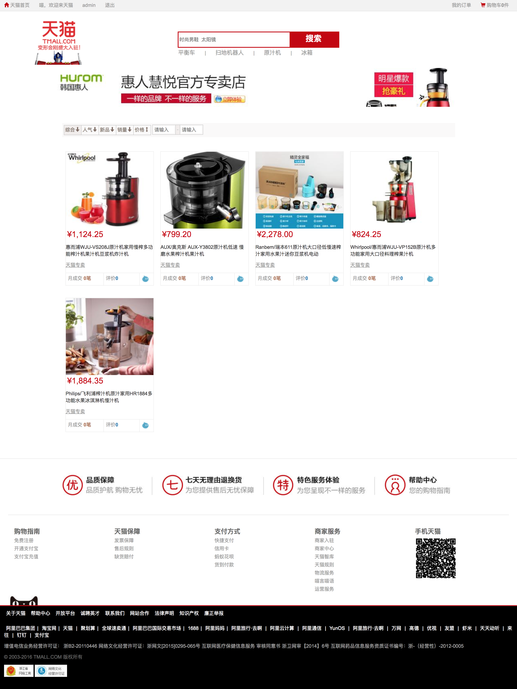
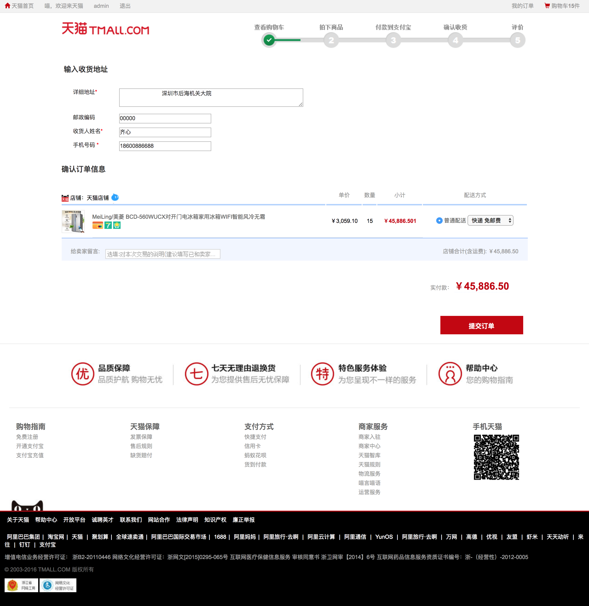
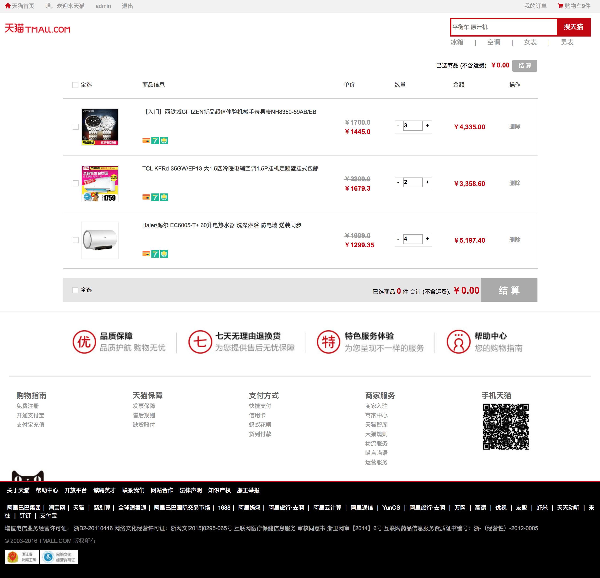
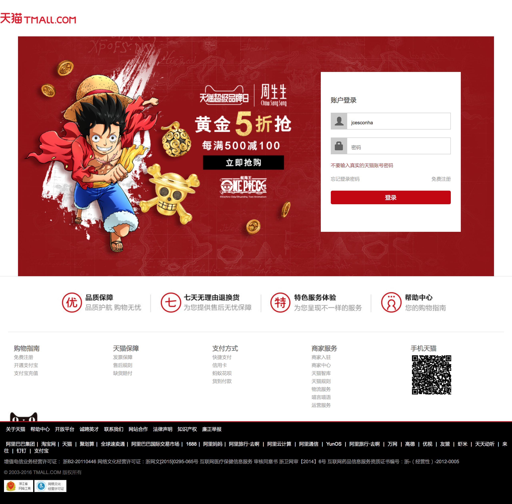
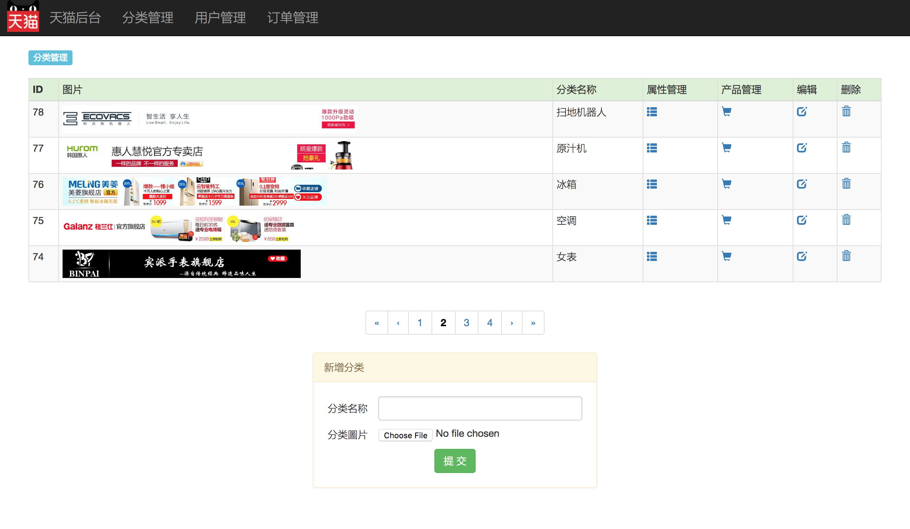
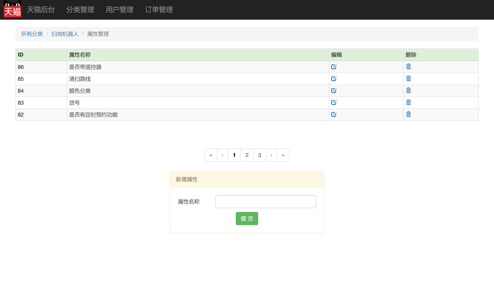
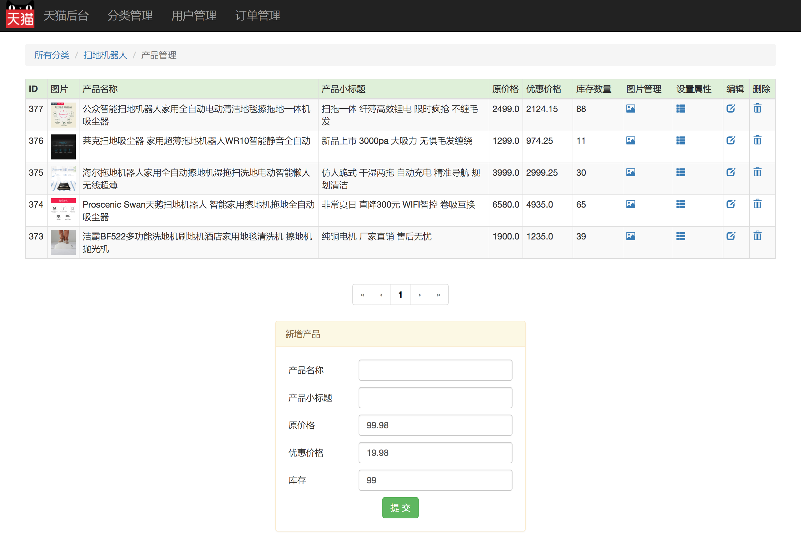
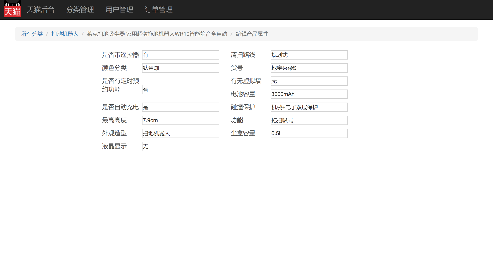
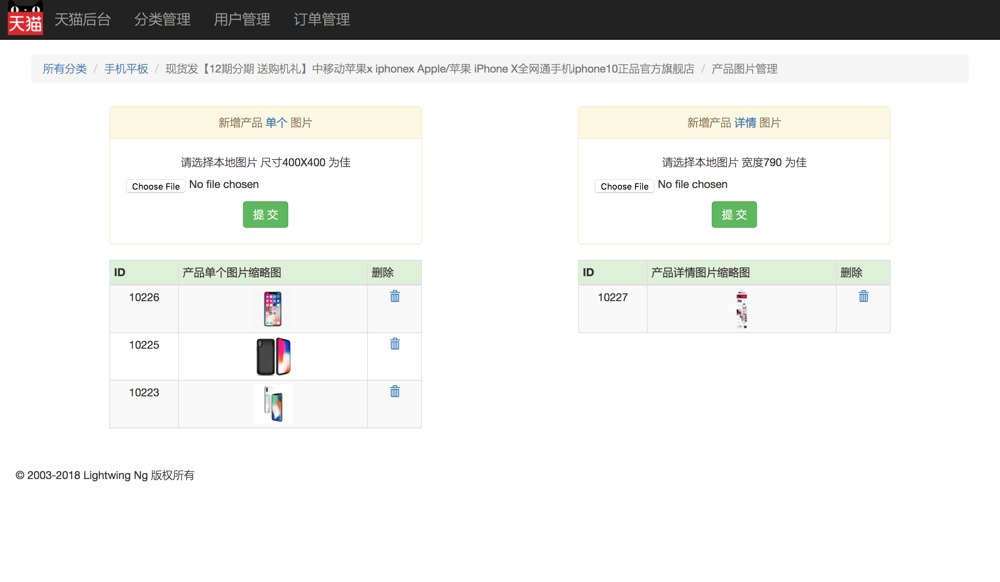
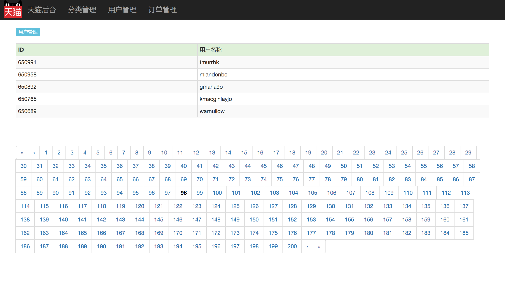

# Java_Tmall

## 1 基础

### 1.1 项目简介

在学习完[模仿天猫前端教程](http://how2j.cn/k/tmall-front/tmall-front-790/790.html)之后， 接下来，我们就要做这么一个[模仿天猫整站](http://how2j.cn/k/tmall-j2ee/tmall-j2ee-894/894.html)项目。   

- 成熟的项目规划与设计  

本教程作者，也就是我~ 有 8 年企业开发管理经验，7 年教学经验，曾参与管理开发几十个商业项目。将展示如何合理设计与规划这样一个规模的电商项目，既做到功能丰富，又让开发节奏有条不紊。   

- 基于 J2EE 整套技术  

本项目没有使用 SSH, SSM 框架，而是使用 J2EE 整套技术来作为解决方案，实现各种业务场景。 
之所以不使用框架，就是为了借助这个项目夯实 J2EE 基础，并且在项目中借助反射等技术，采用了精妙的设计模式，开发效率并不低于使用框架。   

- 由浅入深  

以动手为主，代码驱动，从简单功能开始，逐一展开，配合图文讲解，由浅入深，迭代开发，享受一个项目的从无到有的构建过程   

- 编程思想  

没有枯燥的编程思想的说教，在实际问题，实际解决的过程中融入编程思想与设计模式，从由此带的开发速度提高，维护难度降低中，感受设计模式的力量   

- 典型场景  

一个完整的 J2EE 应用包含的各种典型商务应用场景的需求，展示相应的解决思路与办法   

- 简历中的亮点  

一份能获得面试机会的简历，必须要有项目经验的。 踏踏实实地把这个项目跟完，让简历多一个亮点，多一项谈资，多一层砝码，多一些薪水

### 1.2 功能一览：前台

- 首页


- 分类页



- 查询结果页


- 产品页


- 结算页面



- 支付页面


- 支付成功页面
- 购物车页面



- 我的订单页面

- 确认收货页面
- 确认收货成功页面
- 进行评价页面
- 登录页面



- 注册页面

### 1.3 功能一览：后台

- 分类管理



- 分类属性管理



- 产品管理



- 产品属性管理



- 产品图片管理



- 用户管理



- 订单管理


### 1.4 开发流程

#### 1.4.1 技术准备

- Java: 基础和高级内容
- 前端: HTML/CSS/JavaScript/jQuery
- J2EE: TomCat/Servlet/JSP/Filter
- 数据库: MySQL

#### 1.4.2 开发流程

模仿天猫整站是一个比较大的项目，将按照商业项目的开发流程有条不紊的一一展开：

1. 需求分析

首先确定要做哪些功能，需求分析包括[前台](http://how2j.cn/k/tmall-j2ee/tmall-j2ee-898/898.html)和[后台](http://how2j.cn/k/tmall-j2ee/tmall-j2ee-941/941.html)。  

前台又分为单纯要展示的那些功能-[需求分析-展示](http://how2j.cn/k/tmall-j2ee/tmall-j2ee-898/898.html)，以及会提交数据到服务端的哪些功能-[需求分析-交互](http://how2j.cn/k/tmall-j2ee/tmall-j2ee-940/940.html)。 

2. 婊结构设计

接着是表结构设计，表结构设计是围绕功能需求进行，如果表结构设计有问题，那么将会影响功能的实现。除了[表与表关系](http://how2j
.cn/k/tmall-j2ee/tmall-j2ee-944/944.html)，[建表 SQL 语句](http://how2j
.cn/k/tmall-j2ee/tmall-j2ee-945/945.html)之外，为了更好的帮助大家理解表结构以及关系，还特意把[表与页面功能](http://how2j.cn/k/tmall-j2ee/tmall-j2ee-947/947.html)一一对应起来。

3. 原型

接着是界面原型，与客户沟通顺畅的项目设计流程里一定会有原型这个环节。 借助界面原型，可以低成本，高效率的与客户达成需求的一致性。 同样的，原型分为了[前台原型](http://how2j.cn/k/tmall-j2ee/tmall-j2ee-948/948.html)和[后台原型](http://how2j.cn/k/tmall-j2ee/tmall-j2ee-971/971.html)。

4. 实体类开发

接着开始实体类的设计与开发，实体类不仅仅是对数据库中的表的一一映射，同时还需要兼顾对业务功能的支持。

5. DAO 类设计

然后是[DAO 类的设计](http://how2j.cn/k/tmall-j2ee/tmall-j2ee-983/983.html)，除了进行典型的 ORM 支持功能之外，也需要提供各种业务方法。

6. 业务类介绍

讲解的[业务类](http://how2j.cn/k/tmall-j2ee/tmall-j2ee-995/995.html)的概念，以及为什么在本项目中没有包含这一层

7. 后台：分类管理

接下来开始进行功能开发，按照模块之间的依赖关系，首先进行[后台-分类管理](http://how2j.cn/k/tmall-j2ee/tmall-j2ee-996/996.html)
功能开发。严格来说，这是开发的第一个功能，所以讲解的十分详细，不仅提供了[可运行的项目](http://how2j.cn/k/tmall-j2ee/tmall-j2ee-997/997.html)，还详细解释了其中用到的[设计模式](http://how2j.cn/k/tmall-j2ee/tmall-j2ee-998/998.html)，[JSP 包含关系](http://how2j.cn/k/tmall-j2ee/tmall-j2ee-1006/1006.html)，以及每个具体的功能： [查询](http://how2j.cn/k/tmall-j2ee/tmall-j2ee-999/999.html)，[分页](http://how2j.cn/k/tmall-j2ee/tmall-j2ee-1000/1000.html)，[增加](http://how2j.cn/k/tmall-j2ee/tmall-j2ee-1001/1001.html)，[删除](http://how2j.cn/k/tmall-j2ee/tmall-j2ee-1002/1002.html)，[编辑](http://how2j.cn/k/tmall-j2ee/tmall-j2ee-1003/1003.html)，[修改](http://how2j.cn/k/tmall-j2ee/tmall-j2ee-1004/1004.html)。 把每个细节都掰的很细，可以更好的理解，消化和吸收。 在把[后台-分类管理](http://how2j.cn/k/tmall-j2ee/tmall-j2ee-996/996.html) 吃透之后，后续的其他后台管理功能，做起来就会更加顺畅。

8. 后台：其它管理

在把[后台-分类管理](http://how2j.cn/k/tmall-j2ee/tmall-j2ee-996/996.html) 消化吸收之后，就可以加速进行 [后台其他页面](http://how2j.cn/k/tmall-j2ee/tmall-j2ee-1008/1008.html)的学习。

9. 前台：首页

前台也包括许多功能， 与[后台-分类管理](http://how2j.cn/k/tmall-j2ee/tmall-j2ee-996/996.html)类似的，首先把[前台-首页](http://how2j.cn/k/tmall-j2ee/tmall-j2ee-1015/1015.html)这个功能单独拿出来，进行精讲。[前台-首页](http://how2j.cn/k/tmall-j2ee/tmall-j2ee-1015/1015.html) 消化吸收好之后，再进行其他前台功能的开发。

10. 前台无需登录

从前台模块之间的依赖性，以及开发顺序的合理性来考虑，把前台功能分为了 [无需登录](http://how2j.cn/k/tmall-j2ee/tmall-j2ee-1022/1022.html) 即可使用的功能，和[需要登录](http://how2j.cn/k/tmall-j2ee/tmall-j2ee-1029/1029.html) 才能访问的功能。 建立在前一步[前台-首页](http://how2j.cn/k/tmall-j2ee/tmall-j2ee-1015/1015.html)的基础之上，开始进行一系列的[无需登录](http://how2j.cn/k/tmall-j2ee/tmall-j2ee-1022/1022.html)功能开发。

11. 前台需要登录

最后是[需要登录的前台功能](http://how2j.cn/k/tmall-j2ee/tmall-j2ee-1029/1029.html)。 这部分功能基本上都是和购物相关的。 因此，一开始先把[购物流程](http://how2j.cn/k/tmall-j2ee/tmall-j2ee-1029/1029.html) 单独拿出来捋清楚，其中还特别注明了[购物流程环节与表关系](http://how2j.cn/k/tmall-j2ee/tmall-j2ee-1029/1029.html#step3954)，这样能够更好的建立对前端购物功能的理解。随着这部分功能的开发，就会进入订单生成部分，在此之前，先准备了一个 [订单状态图](http://how2j.cn/k/tmall-j2ee/tmall-j2ee-1043/1043.html#step3978)，在理解了这个图之后，可以更好的进行订单相关功能的开发。

12. 总结

最后总结整个项目的项目结构，都实现了哪些典型场景，运用了哪些设计模式，把学习到的知识都沉淀下来，转换，消化，吸收为自己的技能

### 1.5 本地运行

1. 下载运行
2. 访问地址

- 前台

`http://127.0.0.1:2020/tmall/`

- 后台

`http://127.0.0.1:2020/tmall/admin`

### 1.6 下载配置并运行

1. 观看视频
2. JDK 1.8
3. 导入数据
4. 下载项目
5. 配置 TomCat
6. 访问

### 1.7 如何调试（付费内容）

### 1.8 各个版本的区别

| J2EE版        | SSH 版                                                       | SSM 版                |                                |
| ------------- | ------------------------------------------------------------ | --------------------- | ------------------------------ |
| 前台功能      | 齐备                                                         | 齐备                  | 齐备                           |
| 后台功能      | 齐备                                                         | 齐备                  | 齐备                           |
| 存储层技术    | JDBC                                                         | Hibernate             | Mybatis                        |
| 控制层技术    | Servlet+反射                                                 | Struts2               | Spring MVC                     |
| 教程使用的IDE | Eclipse                                                      | Eclipse               | IntelliJ IDEA(无缝兼容Eclipse) |
| 是否Maven项目 | 否                                                           | 否                    | 是                             |
| 项目格式      | 标准 Java 项目                                               | 动态Web项目           | Maven Web项目                  |
| 启动方式      | Tomcat独立配置启动                                           | Eclipse内置Tomcat启动 | IntelliJ IDEA内置Tomcat启动    |
| 部署到Linux   | [提供独立免费教程-如何把J2EE应用部署到Linux系列教程](http://how2j.cn/k/1591) |                       |                                |

## 2 需求分析

### 2.1 展示

#### 2.1.1 概述

需求简单理解就是要做成什么样子，这些需求都是基于[模仿天猫整站](http://how2j.cn/tmall)整理出来的，主要分为 3 类    

1. 前端展示  

在前端页面上显示数据库中的数据，如首页，产品页，购物车，分类页面等等。  至于这些前端页面如何组织显示，页面布局，CSS 样式设置，JavaScript 交互代码等教学，在单独的[模仿天猫前端教程](http://how2j.cn/k/tmall-front/tmall-front-790/790.html)中详细讲解。  分开学习和讲解，降低学习的难度，避免全部前后端混杂在一起学带来的困扰。   

2. 前端交互  

这里的前端交互，与[模仿天猫前端教程](http://how2j.cn/k/tmall-front/tmall-front-790/790.html)里的交互，不是同一个概念。 [模仿天猫前端教程](http://how2j.cn/k/tmall-front/tmall-front-790/790.html)里的交互，仅仅停留在浏览器上的 JavaScript 交互，这里的交互指的是通过 POST, GET 等 http 协议，与服务端进行同步或者异步数据交互。 比如购买，购物车，生成订单，登录等等功能。   

3. 后台功能  

对支撑整站需要用到的数据，进行管理维护。 比如分类管理，分类属性管理，产品管理，产品图片管理，用户管理，订单管理等等。

#### 2.1.2 首页

1. 完整页面效果


2. 横向导航栏的 4 个分类链接


3. 纵向导航栏的 17 个分类链接


4. 鼠标 hover 分类


5. 按照每种分类显示 5 个商品的方式，显示所有 17 种分类


#### 2.1.3 产品页

1. 显示分辨率为 950*100 的当前商品对应的分类图片


2. 显示本商品的 5 个单独图片


3. 商品的基本信息：如标题/小标题/价格/销量/评价数量/库存等


4. 商品详情


5. 评价信息


6. 5 张详细图片


#### 2.1.4 分类页

1. 显示分辨率为 950*100 的当前分类图片 

      

2. 显示本分类下的所有产品    


#### 2.1.5 搜索结果页

显示满足查询条件的商品


#### 2.1.6 购物车查看页

在购物车中显示订单项


#### 2.1.7 结算页

在结算页面显示被选中的订单项


#### 2.1.8 确认支付页

确认支付页面显示本次订单的金额总数


#### 2.1.9 支付成功页

付款成功时，显示本次付款金额


#### 2.1.10 我的订单页

显示所有订单，以及对应的订单项


#### 2.1.11 确认收货页

1. 显示订单项内容


2. 显示订单信息，收货人地址等


#### 2.1.12 评价页

1. 显示要评价的商品信息，商品当前的总评价数


2. 评价成功后，显示当前商品所有的评价信息


#### 2.1.13 页头信息展示

1. 未登录状态


2. 已登录状态


### 2.2 交互

#### 2.2.1 概述

这里的前端交互，与[模仿天猫前端教程](http://how2j.cn/k/tmall-front/tmall-front-790/790.html)里的交互，不是同一个概念。 模仿天猫前端教程里的交互，仅仅停留在浏览器上的 JavaScript 交互，这里的交互指的是通过 POST, GET 等 http 协议，与服务端进行同步或者异步数据交互。 比如购买，购物车，生成订单，登录等等功能。

#### 2.2.2 分类页排序

1. 按照综合，人气，新品，销量，价格排序 


2. 进行价格筛选，这个不算，这个是做在浏览器端的，并不是和服务器端的交互   


#### 2.2.3 立即购买

1. 在产品页，未登录状态时候，点击立即购买

在产品页，未登录状态时候，点击立即购买，会弹出登录模态窗口   


2. 在产品页，如果已经登录，点击购买

在产品页，如果已经登录，点击购买，会提交数据到服务端，生成订单项，并且跳转到结算页面   


#### 2.2.4 加入购物车

1. 在未登录状态，点击加入购物车


2. 在已登录状态，点击加入购物车，使用 AJAX 异步提交数据到服务端，生成订单项，并且使当前 "加入购物车" 按钮变得不可点击


#### 2.2.5 调整订单项数量

在购物车页面，调整订单项数量


#### 2.2.6 删除订单项

在购物车页面，删除订单项，首先弹出模态窗口确认是否要删除，如果要删除，则通过 Ajax 异步发送指令到服务端，并且在当前页面删除该条订单项


#### 2.2.7 生成订单

在结算页面，提交订单时候，根据结算页面的收货人信息，订单项信息，生成订单数据


#### 2.2.8 订单页功能

订单页面上有 3 个按钮，付款，确认收货和评价，这些按钮都没有提交数据到服务端，而是提交到下一个页面的二次操作，才提交数据到服务端的。


#### 2.2.9 确认付款

点击确认支付，提交本信息到服务端，服务端修改订单中的支付日期


#### 2.2.10 确认收货

确认收货页面，点击确认支付，提交数据到服务端，并且修改订单中的确认收货日期


#### 2.2.11 提交评价信息

提交评价信息到服务端


#### 2.2.12 登录

输入正确账号密码，登录成功后跳转到首页，失败提示错误信息


#### 2.2.13 注册


#### 2.2.14 退出


#### 2.2.15 搜索


#### 2.2.16 前台需求列表

1. 首页

- 在横向导航栏上提供 4 个分类连接
- 在纵向导航栏上提供全部 17 个分类连接
- 当鼠标移动到某一个纵向分类连接的时候，显示这个分类下的推荐商品
- 按照每种分类，显示 5 个商品的方式显示所有 17 种分类

2. 产品页

- 显示分辨率为 950x100 的当前商品对应的分类图片
- 显示本商品的 5 个单独图片
- 商品的基本信息，如标题，小标题，加个，销量，评价数量，库存等
- 商品详情
- 评价信息
- 5 张商品详细图片
- 立即购买
- 加入购物车

3. 分类页

- 显示分辨率为 950x100 的当前分类图片
- 显示本分类下的所有产品
- 分类页排序

4. 搜索结果页

- 显示满足查询条件的商品

5. 购物车查看页

- 在购物车中显示订单项
- 调整订单项数量
- 删除订单项

6. 结算页

- 在结算页面显示被选中的订单项
- 生成订单

7. 确认支付页

- 确认支付页面显示本次订单的金额总数
- 确认付款

8. 支付成功页

- 付款成功时，显示本次付款金额

9. 我的订单页

- 显示所有订单，以及对应的订单项

10. 确认收货页

- 显示订单项内容
- 显示订单信息，收货人地址等
- 确认收货

11. 评价页

- 显示要评价的商品信息，商品当前的总评价数
- 评价成功后，显示当前商品所有的评价信息
- 提交评价信息

12. 页头信息展示

- 未登录状态
- 已登录状态
- 登录
- 注册
- 退出

13. 所有页面

- 搜索

### 2.3 后台

#### 2.3.1 概述

对支撑整站需要用到的数据，进行管理维护。 比如分类管理，分类属性管理， 产品管理，产品图片管理，用户管理，订单管理等等。

#### 2.3.2 分类管理

1. 分页查询

    

2. 新增分类

    

3. 编辑修改

    

4. 删除

    

#### 2.3.3 属性管理

1. 属性概念

这里的属性，指的是产品属性。 
比如太阳镜这种产品，有镜片材质，适合脸型，眼镜配件类型等属性。
而平板电视这种产品，有操作系统，能效等级，网络连接方式等属性。

不同的产品，有不同的属性，以及对应的属性值。

按照传统的数据库的设计方式，就会在产品表里设置不同的字段，而天猫的产品五花八门，有成百上千种不同的属性，难道给一张产品表设置成百上千的字段吗？ 

这样做出来的系统，肯定是不具备维护性的。

为了解决这个问题，引入了产品属性这个概念，假定同一类产品，都有相同的属性。
比如所有的女装，都有 材质成分，尺码，上市年份季节等等属性。 具体到某一件女装，其区别只是在于属性值不一样。

这样在一个分类下，就可以维护一系列的产品属性，针对于不同的产品，再设置不同的值，即可达到保存和维护大量产品属性值的效果。

2. 分页查询


3. 新增属性


4. 编辑修改


5. 删除


#### 2.3.4 产品管理

1. 分页查询


2. 新增产品

   

3. 编辑修改


4. 删除


#### 2.3.5 产品图片管理

1. 产品图片概念

一件产品，对应多条 单个图片
一件产品，对应多条 详情图片

所以这部分单独做一个页面进行管理

2. 产品图片管理


#### 2.3.6 产品属性设置

根据属性管理中的讲解，一种产品所具备的属性，在其对应的分类中进行了维护。

那么，要修改产品的这些属性值，就在本页面进行。

这里采用异步提交方式，编辑即修改,修改成功用绿色边框表示


#### 2.3.7 用户管理

用户管理就提供了一个分页查询，做的比较简约，几个原因： 

1. 用户是不能删除的 
2. 用户信息的修改，应该交由前端由客户自己修改，比如密码，基本信息等 
3. 用户的增加，是前端注册导致的，后台不负责用户的增加  所以，增，删，改功能在后台就不提供了，仅仅提供一个分页查询


#### 2.3.8 订单管理

1. 订单分页查询   

 

2. 查看详情


3. 发货

    

#### 2.3.9 后台需求列表

1. 分类管理

- 分页查询
- 新增分类
- 编辑修改
- 删除

2. 属性管理

- 属性概念
- 分页查询
- 新增属性
- 编辑修改
- 删除

3. 产品管理

- 分页查询
- 新增产品
- 编辑修改
- 删除

4. 产品图片管理

- 产品图片概念
- 产品图片管理

5. 产品属性设置

- 产品属性值设置

6. 用户管理

- 分页查询

7. 订单管理

- 订单分页查询
- 查看详情
- 发货

## 3 表结构设计

### 3.1 概述

在需求分析结束之后，接下来要做的不是马上开发功能，而是进行表结构的设计。 
只有把表结构设计正确了，才能支撑软件后续的功能开发，这一步是非常重要的。 
为了便于大家理解表结构设计的过程，把设计过程分解成了 

1. 数据库的创建 
2. 表与表关系 
3. 建表 SQL 语句 
4. 表与页面 

这么几个步骤，然后再把几个步骤放在一起做一遍。方便大家理解

### 3.2 数据库

创建数据库:tmall 并且将数据库的编码设置为 utf8，便于存放中文

```sql
DROP DATABASE IF EXISTS tmall;
CREATE DATABASE tmall DEFAULT CHARACTER SET utf8;
```

### 3.3 表与表的关系

1. 表关系图

在这张表关系图上，列出了模仿天猫整站一共需要用到的 9 张表，以及表之间的关系。接下来，对每张表做介绍，并讲解表与表之间的关系


2. 表    

| 表名          | 中文含义   | 介绍                                                |
| ------------- | ---------- | --------------------------------------------------- |
| Category      | 分类表     | 存放分类信息，如女装，平板电视，沙发等              |
| Property      | 属性表     | 存放属性信息，如颜色，重量，品牌，厂商，型号等      |
| Product       | 产品表     | 存放产品信息，如LED40EC平板电视机，海尔EC6005热水器 |
| PropertyValue | 属性值表   | 存放属性值信息，如重量是900g,颜色是粉红色           |
| ProductImage  | 产品图片表 | 存放产品图片信息，如产品页显示的5个图片             |
| Review        | 评论表     | 存放评论信息，如买回来的蜡烛很好用，么么哒          |
| User          | 用户表     | 存放用户信息，如斩手狗，千手小粉红                  |
| Order         | 订单表     | 存放订单信息，包括邮寄地址，电话号码等信息          |
| OrderItem     | 订单项表   | 存放订单项信息，包括购买产品种类，数量等            |

3. 正确的分析表与表之间的关系的方法

表与表之间的关系，基本上是 3 种

- 一对一
- 一对多
- 多对一

那么怎么判断关系到底是什么呢？
以分类和产品为例子，分类表里有多条数据，产品表里也有多条数据，那么他们的关系是多对多吗？ 从经验上讲，我们知道这个结果是不正确的。

正确的分析表与表之间的关系的方法是这样：
**一个**分类对应**多个**产品
**一个**产品对应**一个**分类

所以分类和产品之间的关系是一对多


4. 表关系    

从最上面的表关系图中可以看到，有关系的表之间，都是一对多关系(反过来就是多对一关系)，并没有一对一关系，和多对多关系。

所以本表列出了所有的一对多关系

注：产品和用户之间其实是多对多关系，即一个用户可以购买多种产品，一种产品可以被多个用户购买。 但是他们的多对多关系是间接的建立在订单项表(OrderItem)上的。

| ONE           | MANY                  |
| ------------- | --------------------- |
| Category-分类 | Product-产品          |
| Category-分类 | Property-属性         |
| Property-属性 | PropertyValue-属性值  |
| Product-产品  | PropertyValue-属性值  |
| Product-产品  | ProductImage-产品图片 |
| Product-产品  | Review-评价           |
| User-用户     | Order-订单            |
| Product-产品  | OrderItem-订单项      |
| User-用户     | OrderItem-订单项      |
| Order-订单    | OrderItem-订单项      |
| User-用户     | User-评价             |

### 3.4 建表 SQL 语句

1. 建表顺序    

在建表过程中，会设置外键约束，所以表和表之间有依赖关系。 因此会先建立被外键指向的表，比如 User, Category，然后再是其他表

2. 用户表

```sql
CREATE TABLE tmall.user
(
    id INT AUTO_INCREMENT
        PRIMARY KEY,
    name VARCHAR(255) NULL,
    password VARCHAR(255) NULL
)
    ENGINE = InnoDB;
```

3. 分类表

```sql
CREATE TABLE tmall.category
(
    id INT AUTO_INCREMENT
        PRIMARY KEY,
    name VARCHAR(255) NULL
)
    ENGINE = InnoDB;
```

4. 属性表

从这个表开始， 既有外键约束了。 本表的外键 cid，指向分类表的 id 字段

```sql
CREATE TABLE tmall.property
(
    id INT AUTO_INCREMENT
        PRIMARY KEY,
    cid INT NULL,
    name VARCHAR(255) NULL,
    CONSTRAINT fk_property_category
    FOREIGN KEY (cid) REFERENCES tmall.category (id)
)
    ENGINE = InnoDB;

CREATE INDEX fk_property_category
    ON tmall.property (cid);
```

5. 产品表    

产品表字段稍多，讲解一下 

name: 产品名称 

subTitle: 小标题 

orignalPrice: 原始价格 

promotePrice: 优惠价格 

stock: 库存 

createDate: 创建日期  

本表的外键 cid，指向分类表的 id 字段

```sql
CREATE TABLE tmall.product
(
    id INT AUTO_INCREMENT
        PRIMARY KEY,
    name VARCHAR(255) NULL,
    subTitle VARCHAR(255) NULL,
    orignalPrice FLOAT NULL,
    promotePrice FLOAT NULL,
    stock INT NULL,
    cid INT NULL,
    createDate DATETIME NULL,
    CONSTRAINT fk_product_category
    FOREIGN KEY (cid) REFERENCES tmall.category (id)
)
    ENGINE = InnoDB;

CREATE INDEX fk_product_category
    ON tmall.product (cid);
```

6. 属性值表    

本表有两个外键 外键 ptid，指向属性表的 id 字段 外键 pid，指向产品表的 id 字段

```sql
CREATE TABLE tmall.propertyvalue
(
    id INT AUTO_INCREMENT
        PRIMARY KEY,
    pid INT NULL,
    ptid INT NULL,
    value VARCHAR(255) NULL,
    CONSTRAINT fk_propertyvalue_property
    FOREIGN KEY (ptid) REFERENCES tmall.property (id)
)
    ENGINE = InnoDB;

CREATE INDEX fk_propertyvalue_property
    ON tmall.propertyvalue (ptid);
```

7. 产品图片表    

type 表示类型，产品图片分单个图片和详情图片两种  本表的外键 pid，指向产品表的 id 字段

```sql
CREATE TABLE tmall.productimage
(
    id INT AUTO_INCREMENT
        PRIMARY KEY,
    pid INT NULL,
    type VARCHAR(255) NULL,
    CONSTRAINT fk_productimage_product
    FOREIGN KEY (pid) REFERENCES tmall.product (id)
)
    ENGINE = InnoDB;

CREATE INDEX fk_productimage_product
    ON tmall.productimage (pid);
```

8. 评价表    

外键 pid，指向产品表的 id 字段 外键 uid，指向用户表的 id 字段

```sql
CREATE TABLE tmall.review
(
    id INT AUTO_INCREMENT
        PRIMARY KEY,
    content VARCHAR(4000) NULL,
    uid INT NULL,
    pid INT NULL,
    createDate DATETIME NULL,
    CONSTRAINT fk_review_user
    FOREIGN KEY (uid) REFERENCES tmall.user (id),
    CONSTRAINT fk_review_product
    FOREIGN KEY (pid) REFERENCES tmall.product (id)
)
    ENGINE = InnoDB;

CREATE INDEX fk_review_product
    ON tmall.review (pid);

CREATE INDEX fk_review_user
    ON tmall.review (uid);
```

9. 订单表    

订单表的字段也比较多，讲解一下： 

orderCode： 订单号 

address:收货地址 

post: 邮编 

receiver: 收货人信息 

mobile: 手机号码 

userMessage: 用户备注信息 

createDate: 订单创建日期 

payDate: 支付日期 

deliveryDate: 发货日期 

confirmDate：确认收货日期 

status: 订单状态 外键 uid，指向用户表 id 字段

```sql
CREATE TABLE tmall.order_
(
    id INT AUTO_INCREMENT
        PRIMARY KEY,
    orderCode VARCHAR(255) NULL,
    address VARCHAR(255) NULL,
    post VARCHAR(255) NULL,
    receiver VARCHAR(255) NULL,
    mobile VARCHAR(255) NULL,
    userMessage VARCHAR(255) NULL,
    createDate DATETIME NULL,
    payDate DATETIME NULL,
    deliveryDate DATETIME NULL,
    confirmDate DATETIME NULL,
    uid INT NULL,
    status VARCHAR(255) NULL,
    CONSTRAINT fk_order_user
    FOREIGN KEY (uid) REFERENCES tmall.user (id)
)
    ENGINE = InnoDB;

CREATE INDEX fk_order_user
    ON tmall.order_ (uid);
```

10. 订单项表    

这个表是外键最多的一个表
外键 pid，指向产品表 id 字段
外键 oid，指向订单表 id 字段
外键 uid，指向用户表 id 字段
number 字段表示购买数量
注： oid 外键没有加约束，是因为创建订单项的时候，其所对应的订单可能还未创建

```sql
CREATE TABLE tmall.orderitem
(
    id INT AUTO_INCREMENT
        PRIMARY KEY,
    pid INT NULL,
    oid INT NULL,
    uid INT NULL,
    number INT NULL,
    CONSTRAINT fk_orderitem_product
    FOREIGN KEY (pid) REFERENCES tmall.product (id),
    CONSTRAINT fk_orderitem_user
    FOREIGN KEY (uid) REFERENCES tmall.user (id)
)
    ENGINE = InnoDB;

CREATE INDEX fk_orderitem_product
    ON tmall.orderitem (pid);

CREATE INDEX fk_orderitem_user
    ON tmall.orderitem (uid);
```

### 3.5 表与页面

1. 表与页面

为了协助大家更好的理解这些表，本章节把这些表对应的部分页面一一对照起来。 如此便于大家把表中的数据与界面效果关联起来。

2. 用户表

登录页面采集用户的账号和密码


```sql
CREATE TABLE tmall.user
(
    id INT AUTO_INCREMENT
        PRIMARY KEY,
    name VARCHAR(255) NULL,
    password VARCHAR(255) NULL
)
    ENGINE = InnoDB;
```

3. 分类表

首页的竖状导航栏显示所有 17 种分类信息


```sql
CREATE TABLE tmall.category
(
    id INT AUTO_INCREMENT
        PRIMARY KEY,
    name VARCHAR(255) NULL
)
    ENGINE = InnoDB;
```

4. 属性表


```sql
CREATE TABLE tmall.property
(
    id INT AUTO_INCREMENT
        PRIMARY KEY,
    cid INT NULL,
    name VARCHAR(255) NULL,
    CONSTRAINT fk_property_category
    FOREIGN KEY (cid) REFERENCES tmall.category (id)
)
    ENGINE = InnoDB;

CREATE INDEX fk_property_category
    ON tmall.property (cid);
```

5. 产品表

产品页的产品信息里显示本产品的名称，小标题，原始价格，促销价，销量，库存等信息


```sql
CREATE TABLE tmall.product
(
    id INT AUTO_INCREMENT
        PRIMARY KEY,
    name VARCHAR(255) NULL,
    subTitle VARCHAR(255) NULL,
    orignalPrice FLOAT NULL,
    promotePrice FLOAT NULL,
    stock INT NULL,
    cid INT NULL,
    createDate DATETIME NULL,
    CONSTRAINT fk_product_category
    FOREIGN KEY (cid) REFERENCES tmall.category (id)
)
    ENGINE = InnoDB;

CREATE INDEX fk_product_category
    ON tmall.product (cid);
```

6. 属性值表

```sql
CREATE TABLE tmall.propertyvalue
(
    id INT AUTO_INCREMENT
        PRIMARY KEY,
    pid INT NULL,
    ptid INT NULL,
    value VARCHAR(255) NULL,
    CONSTRAINT fk_propertyvalue_property
    FOREIGN KEY (ptid) REFERENCES tmall.property (id)
)
    ENGINE = InnoDB;

CREATE INDEX fk_propertyvalue_property
    ON tmall.propertyvalue (ptid);
```

7. 产品图片表    

```sql
CREATE TABLE tmall.productimage
(
    id INT AUTO_INCREMENT
        PRIMARY KEY,
    pid INT NULL,
    type VARCHAR(255) NULL,
    CONSTRAINT fk_productimage_product
    FOREIGN KEY (pid) REFERENCES tmall.product (id)
)
    ENGINE = InnoDB;

CREATE INDEX fk_productimage_product
    ON tmall.productimage (pid);
```

8. 评价表    

```sql
CREATE TABLE tmall.review
(
    id INT AUTO_INCREMENT
        PRIMARY KEY,
    content VARCHAR(4000) NULL,
    uid INT NULL,
    pid INT NULL,
    createDate DATETIME NULL,
    CONSTRAINT fk_review_user
    FOREIGN KEY (uid) REFERENCES tmall.user (id),
    CONSTRAINT fk_review_product
    FOREIGN KEY (pid) REFERENCES tmall.product (id)
)
    ENGINE = InnoDB;

CREATE INDEX fk_review_product
    ON tmall.review (pid);

CREATE INDEX fk_review_user
    ON tmall.review (uid);
```

9. 订单表    

```sql
CREATE TABLE tmall.order_
(
    id INT AUTO_INCREMENT
        PRIMARY KEY,
    orderCode VARCHAR(255) NULL,
    address VARCHAR(255) NULL,
    post VARCHAR(255) NULL,
    receiver VARCHAR(255) NULL,
    mobile VARCHAR(255) NULL,
    userMessage VARCHAR(255) NULL,
    createDate DATETIME NULL,
    payDate DATETIME NULL,
    deliveryDate DATETIME NULL,
    confirmDate DATETIME NULL,
    uid INT NULL,
    status VARCHAR(255) NULL,
    CONSTRAINT fk_order_user
    FOREIGN KEY (uid) REFERENCES tmall.user (id)
)
    ENGINE = InnoDB;

CREATE INDEX fk_order_user
    ON tmall.order_ (uid);
```

10. 订单项表  

```sql
CREATE TABLE tmall.orderitem
(
    id INT AUTO_INCREMENT
        PRIMARY KEY,
    pid INT NULL,
    oid INT NULL,
    uid INT NULL,
    number INT NULL,
    CONSTRAINT fk_orderitem_product
    FOREIGN KEY (pid) REFERENCES tmall.product (id),
    CONSTRAINT fk_orderitem_user
    FOREIGN KEY (uid) REFERENCES tmall.user (id)
)
    ENGINE = InnoDB;

CREATE INDEX fk_orderitem_product
    ON tmall.orderitem (pid);

CREATE INDEX fk_orderitem_user
    ON tmall.orderitem (uid);
```

### 3.6 小结

```sql

```

## 4 实体类设计

### 4.1 概述

所谓的实体类，就是对于数据库中的表的互相映射的类。 

这是一种 ORM 的设计思想，即一个对象，对应数据库里的一条记录 

基于前面数据库表结构的分析和设计，根据创建表的 SQL 语句，和表与页面一一对应关系,按照表与表之间的依赖顺序，逐个设计总计九个实体类

### 4.2 User

1. 项目

到了这里，就开始真正写代码了。

首先建立 java project: tmall
注：不要用 Dynamic Web Project，而是使用 Java project。
后续的 tomcat 中的配置都是基于 java project 上进行的

```powershell
.
├── src
│   └── tmall
│       ├── bean
│       ├── comparator
│       ├── dao
│       ├── filter
│       ├── servlet
│       ├── test
│       └── util
└── web
```

2. 包名    

所有的实体类，都放在包 tmall.bean 中

3. User.java

User 类主要就是提供 id, name, password 的 getter 和 setter.  其中 getAnonymousName 表示获取本用户的匿名名称，在评价的时候显示用户名使用。

```sql
package tmall.bean;

/**
 * @ClassName User
 * @Description TODO
 * @Author Lightwing Ng
 * @DateTime 2018/8/15, 13:58
 * @Version 1.0
 **/
public class User {
    private String password;
    private String name;
    private int id;

    public int getId() {
        return id;
    }

    public void setId(int id) {
        this.id = id;
    }

    public String getPassword() {
        return password;
    }

    public void setPassword(String password) {
        this.password = password;
    }

    public String getName() {
        return name;
    }

    public void setName(String name) {
        this.name = name;
    }

    public String getAnonymousName() {
        if (null == name)
            return null;

        if (name.length() <= 1)
            return "*";

        if (name.length() == 2)
            return name.substring(0, 1) + "*";

        char[] cs = name.toCharArray();
        for (int i = 1; i < cs.length - 1; i++) {
            cs[i] = '*';
        }
        return new String(cs);
    }
}
```

### 4.3 Category

1. Category.java

Category 除了基本属性 id 和 name 的 getter 和 setter 外，还提供了一对多关系 products 的 getter 与 setter。

另外还有一个 `List<List<Product>> productsByRow;` 属性， 这个属性在下个步骤配合截图讲解

```java
public String toString() {
    return "Category [name=" + name + "]";
}
```

表示重写 toString 方法，当打印 Category 对象的时候，会打印其名称。 在实际业务的时候并没有调用，在测试的过程中会调用到。

```java
package tmall.bean;

import java.util.List;

/**
 * @ClassName Category
 * @Description TODO
 * @Author Lightwing Ng
 * @DateTime 2018/8/15, 13:55
 * @Version 1.0
 **/
public class Category {
    private String name;
    private int id;
    private List<Product> products;
    private List<List<Product>> productsByRow;

    public int getId() {
        return id;
    }

    public void setId(int id) {
        this.id = id;
    }

    public String getName() {
        return name;
    }

    public void setName(String name) {
        this.name = name;
    }

    @Override
    public String toString() {
        return "Category [name=" + name + "]";
    }

    public List<Product> getProducts() {
        return products;
    }

    public void setProducts(List<Product> products) {
        this.products = products;
    }

    public List<List<Product>> getProductsByRow() {
        return productsByRow;
    }

    public void setProductsByRow(List<List<Product>> productsByRow) {
        this.productsByRow = productsByRow;
    }
}
```

2. productByRow

`productsByRow` 这个属性的类型是 `List<List<Product>> productsByRow`。
即一个分类又对应多个 `List<Product>`，提供这个属性，是为了在首页竖状导航的分类名称右边显示产品列表。

如截图所示，一个分类会对应多行产品，而一行产品里又有多个产品记录。
为了实现界面上的这个功能，为 `Category` 类设计了
`List<List<Product>> productsByRow` 这样一个集合属性


### 4.4 Property

Property.java

1. 基本属性的 getter、setter
2. 与 Category 的多对一关系

如图所示，这些属性，都属于平板电视这个分类。


```java
package tmall.bean;

/**
 * @ClassName Property
 * @Description TODO
 * @Author Lightwing Ng
 * @DateTime 2018/8/15, 13:58
 * @Version 1.0
 **/
public class Property {
    private String name;
    private Category category;
    private int id;

    public int getId() {
        return id;
    }

    public void setId(int id) {
        this.id = id;
    }

    public String getName() {
        return name;
    }

    public void setName(String name) {
        this.name = name;
    }

    public Category getCategory() {
        return category;
    }

    public void setCategory(Category category) {
        this.category = category;
    }
}
```

### 4.5 Product

1. Product.java

- 与数据库相关字段一一对应的基本属性
- 与 Category 的多对一关系
- 与 ProductImage 的一对多关系
- firstProductImage 这个属性，是从 productSingleImages 集合中取出第一个来，用于显示这个产品的默认图片。
- reviewCount, saleCount 这两个字段，分别表示评价数量和销售数量，并不是在数据库中对应的字段。

注：截至目前为止，还没有 ProductImage 类，所以暂时会编译错误，下一个知识点就会提供 ProductImage 类了

```java
package tmall.bean;

import java.util.Date;
import java.util.List;

/**
 * @ClassName Product
 * @Description TODO
 * @Author Lightwing Ng
 * @DateTime 2018/8/15, 13:58
 * @Version 1.0
 **/
public class Product {
    private String name;
    private String subTitle;
    private float orignalPrice;
    private float promotePrice;
    private int stock;
    private Date createDate;
    private Category category;
    private int id;
    private ProductImage firstProductImage;
    private List<ProductImage> productImages;
    private List<ProductImage> productSingleImages;
    private List<ProductImage> productDetailImages;
    private int reviewCount;
    private int saleCount;

    public String getName() {
        return name;
    }

    public void setName(String name) {
        this.name = name;
    }

    public String getSubTitle() {
        return subTitle;
    }

    public void setSubTitle(String subTitle) {
        this.subTitle = subTitle;
    }

    public float getOrignalPrice() {
        return orignalPrice;
    }

    public void setOrignalPrice(float orignalPrice) {
        this.orignalPrice = orignalPrice;
    }

    public float getPromotePrice() {
        return promotePrice;
    }

    public void setPromotePrice(float promotePrice) {
        this.promotePrice = promotePrice;
    }

    public int getStock() {
        return stock;
    }

    public void setStock(int stock) {
        this.stock = stock;
    }

    public Date getCreateDate() {
        return createDate;
    }

    public void setCreateDate(Date createDate) {
        this.createDate = createDate;
    }

    public Category getCategory() {
        return category;
    }

    public void setCategory(Category category) {
        this.category = category;
    }

    public int getId() {
        return id;
    }

    public void setId(int id) {
        this.id = id;
    }

    public String toString() {
        return name;
    }

    public ProductImage getFirstProductImage() {
        return firstProductImage;
    }

    public void setFirstProductImage(ProductImage firstProductImage) {
        this.firstProductImage = firstProductImage;
    }

    public List<ProductImage> getProductImages() {
        return productImages;
    }

    public void setProductImages(List<ProductImage> productImages) {
        this.productImages = productImages;
    }

    public List<ProductImage> getProductSingleImages() {
        return productSingleImages;
    }

    public void setProductSingleImages(List<ProductImage> productSingleImages) {
        this.productSingleImages = productSingleImages;
    }

    public List<ProductImage> getProductDetailImages() {
        return productDetailImages;
    }

    public void setProductDetailImages(List<ProductImage> productDetailImages) {
        this.productDetailImages = productDetailImages;
    }

    public int getReviewCount() {
        return reviewCount;
    }

    public void setReviewCount(int reviewCount) {
        this.reviewCount = reviewCount;
    }

    public int getSaleCount() {
        return saleCount;
    }

    public void setSaleCount(int saleCount) {
        this.saleCount = saleCount;
    }
}
```

2. 相关功能页面截图-理解 ProductImage

单个产品图片集合 productSingleImages
详情产品集合：productDetailImages


3. 相关功能页面截图-理解 reviewCount, saleCount


### 4.6 ProductImage

1. 基础属性的 getter、setter
2. 与 Product 的多对一关系

```java
package tmall.bean;

/**
 * @ClassName ProductImage
 * @Description TODO
 * @Author Lightwing Ng
 * @DateTime 2018/8/15, 13:56
 * @Version 1.0
 **/
public class ProductImage {
    private String type;
    private Product product;
    private int id;

    public int getId() {
        return id;
    }

    public void setId(int id) {
        this.id = id;
    }

    public String getType() {
        return type;
    }

    public void setType(String type) {
        this.type = type;
    }

    public Product getProduct() {
        return product;
    }

    public void setProduct(Product product) {
        this.product = product;
    }
}
```

### 4.7 PropertyValue

1. 基本属性的 getter、setter 
2. 与 Product 的多对一关系 
3. 与 Propety 的多对一关系  如图所示，一个属性值，需要同时关联 Property 和 Product


```java
CREATE TABLE tmall.propertyvalue
(
    id INT AUTO_INCREMENT
        PRIMARY KEY,
    pid INT NULL,
    ptid INT NULL,
    value VARCHAR(255) NULL,
    CONSTRAINT fk_propertyvalue_property
    FOREIGN KEY (ptid) REFERENCES tmall.property (id)
)
    ENGINE = InnoDB;

CREATE INDEX fk_propertyvalue_property
    ON tmall.propertyvalue (ptid);
```

### 4.8 Review

1. 基本属性的 getter、setter 
2. 与 User 的多对一关系 
3. 与 Product 的多对一关系


```java
package tmall.bean;

import java.util.Date;

/**
 * @ClassName Review
 * @Description TODO
 * @Author Lightwing Ng
 * @DateTime 2018/8/15, 13:58
 * @Version 1.0
 **/
public class Review {
    private String content;
    private Date createDate;
    private User user;
    private Product product;
    private int id;

    public int getId() {
        return id;
    }

    public void setId(int id) {
        this.id = id;
    }

    public String getContent() {
        return content;
    }

    public void setContent(String content) {
        this.content = content;
    }

    public Date getCreateDate() {
        return createDate;
    }

    public void setCreateDate(Date createDate) {
        this.createDate = createDate;
    }

    public User getUser() {
        return user;
    }

    public void setUser(User user) {
        this.user = user;
    }

    public Product getProduct() {
        return product;
    }

    public void setProduct(Product product) {
        this.product = product;
    }
}
```

### 4.9 Order

1. Order.java

- 基本属性的 getter, setter 
- 与 OrderItem 的一对多关系 
- total, totalNumber 这个订单的总金额和总数量

```java
public class Order {
    private String orderCode;
    private String address;
    private String post;
    private String receiver;
    private String mobile;
    private String userMessage;
    private Date createDate;
    private Date payDate;
    private Date deliveryDate;
    private Date confirmDate;
    private User user;
    private int id;
    private List<OrderItem> orderItems;
    private float total;
    private int totalNumber;
    private String status;

    public String getStatusDesc() {
        String desc = "未知";
        switch (status) {
            case OrderDAO.waitPay:
                desc = "待付款";
                break;
            case OrderDAO.waitDelivery:
                desc = "待发货";
                break;
            case OrderDAO.waitConfirm:
                desc = "待收货";
                break;
            case OrderDAO.waitReview:
                desc = "等评价";
                break;
            case OrderDAO.finish:
                desc = "完成";
                break;
            case OrderDAO.delete:
                desc = "刪除";
                break;
            default:
                desc = "未知";
        }
        return desc;
    }

    public int getId() {
        return id;
    }

    public void setId(int id) {
        this.id = id;
    }

    public String getAddress() {
        return address;
    }

    public void setAddress(String address) {
        this.address = address;
    }

    public String getPost() {
        return post;
    }

    public void setPost(String post) {
        this.post = post;
    }


    public String getMobile() {
        return mobile;
    }

    public void setMobile(String mobile) {
        this.mobile = mobile;
    }

    public String getUserMessage() {
        return userMessage;
    }

    public void setUserMessage(String userMessage) {
        this.userMessage = userMessage;
    }

    public Date getCreateDate() {
        return createDate;
    }

    public void setCreateDate(Date createDate) {
        this.createDate = createDate;
    }

    public Date getPayDate() {
        return payDate;
    }

    public void setPayDate(Date payDate) {
        this.payDate = payDate;
    }

    public Date getDeliveryDate() {
        return deliveryDate;
    }

    public void setDeliveryDate(Date deliveryDate) {
        this.deliveryDate = deliveryDate;
    }

    public Date getConfirmDate() {
        return confirmDate;
    }

    public void setConfirmDate(Date confirmDate) {
        this.confirmDate = confirmDate;
    }

    public String getReceiver() {
        return receiver;
    }

    public void setReceiver(String receiver) {
        this.receiver = receiver;
    }

    public String getOrderCode() {
        return orderCode;
    }

    public void setOrderCode(String orderCode) {
        this.orderCode = orderCode;
    }

    public User getUser() {
        return user;
    }

    public void setUser(User user) {
        this.user = user;
    }

    public List<OrderItem> getOrderItems() {
        return orderItems;
    }

    public void setOrderItems(List<OrderItem> orderItems) {
        this.orderItems = orderItems;
    }

    public float getTotal() {
        return total;
    }

    public void setTotal(float total) {
        this.total = total;
    }

    public String getStatus() {
        return status;
    }

    public void setStatus(String status) {
        this.status = status;
    }

    public int getTotalNumber() {
        return totalNumber;
    }

    public void setTotalNumber(int totalNumber) {
        this.totalNumber = totalNumber;
    }
}
```

2. 相关功能页面截图-理解与 OrderItem 的一对多关系

一个订单下有多个订单项


3. 相关功能页面截图-理解 total, totalNumber

订单的总金额和商品总数量


4. 相关功能页面截图-理解 getStatusDesc

在数据库中存放的 Status 是英文，而在界面上需要把这些英文对应的中文显示出来  这些英文是常量，保存在 OrderDAO 上，但是借助目前为止还没有讲到 OrderDAO 
类，所以这部分代码注释掉了


### 4.10 OrderItem

1. OrderItem

- 基本属性的 getter、setter
- 与 Product 的多对一关系
- 与 User 的多对一关系
- 与 Order 的多对一关系

```java
package tmall.bean;

/**
 * @ClassName OrderItem
 * @Description TODO
 * @Author Lightwing Ng
 * @DateTime 2018/8/15, 13:56
 * @Version 1.0
 **/
public class OrderItem {
    private int number;
    private Product product;
    private Order order;
    private User user;
    private int id;

    public int getNumber() {
        return number;
    }

    public void setNumber(int number) {
        this.number = number;
    }

    public Product getProduct() {
        return product;
    }

    public void setProduct(Product product) {
        this.product = product;
    }

    public Order getOrder() {
        return order;
    }

    public void setOrder(Order order) {
        this.order = order;
    }

    public User getUser() {
        return user;
    }

    public void setUser(User user) {
        this.user = user;
    }

    public int getId() {
        return id;
    }

    public void setId(int id) {
        this.id = id;
    }
}
```

2. 相关功能页面截图-理解与 User、Product 的多对一关系

在产品页面，立即购买，或者加入购物车就会创建一条 OrderItem 对象。 而此时必须有 Product，并且是登录状态(能够从 Session 中取出 User) 但是此时还没有和 Order 
关联起来


4. 相关功能页面截图-理解与 Order 的多对一关系  


### 4.11 所有实体类

## 5 DAO 类设计

### 5.1 概述

接下来是 DAO 类，DAO 是 Data Access Object 的缩写，这些类专门用于进行数据库访问的操作。 

1. 首先讲解两个工具类，DBUtil 和 DateUtil，因为在 DAO 类中会用到这两个工具类 

2. 接着按照依赖顺序，逐个讲解不同的 DAO 类以及其中的方法

### 5.2 工具类

1. DBUtil

DBUtil：数据库工具类，这个类的作用是初始化驱动，并且提供一个 getConnection 用于获取连接。 在后续的所有 DAO 中，当需要获取连接的时候，都采用这种方式进行。
数据库连接的参数，如数据库名称，账号密码，编码方式等都设计在属性上，便于统一修改，降低维护成本。

```java
package tmall.util;

import java.sql.Connection;
import java.sql.DriverManager;
import java.sql.SQLException;

/**
 * @ClassName DBUtil
 * @Description TODO
 * @Author Lightwing Ng
 * @DateTime 2018/8/15, 14:14
 * @Version 1.0
 **/
public class DBUtil {
    static {
        try {
            Class.forName("com.mysql.jdbc.Driver");
        } catch (ClassNotFoundException e) {
            e.printStackTrace();
        }
    }

    public static Connection getConnection() throws SQLException {
        String ip = "127.0.0.1";
        int port = 3306;
        String database = "tmall";
        String encoding = "UTF-8";
        String url = String.format("jdbc:mysql://%s:%d/%s?characterEncoding=%s", ip, port, database, encoding);
        String loginName = "root";
        String password = "canton0520";
        return DriverManager.getConnection(url, loginName, password);
    }

    public static void main(String[] args) throws SQLException {
        System.out.println(getConnection());
    }
}

```

2. DateUtil

DateUtil 这个日期工具类主要是用于 java.util.Date 类与 java.sql.Timestamp 类的互相转换。

因为在实体类中日期类型的属性，使用的都是 java.util.Date 类。
而为了在 MySQL 中的日期格式里保存时间信息，必须使用 datetime 类型的字段，而 jdbc 要获取 datetime 类型字段的信息，需要采用 java.sql
.Timestamp 来获取，否则只会保留日期信息，而丢失时间信息。

```java
package tmall.util;

/**
 * @ClassName DateUtil
 * @Description TODO
 * @Author Lightwing Ng
 * @DateTime 2018/8/15, 14:14
 * @Version 1.0
 **/
public class DateUtil {
    public static java.sql.Timestamp d2t(java.util.Date d) {
        if (null == d)
            return null;
        return new java.sql.Timestamp(d.getTime());
    }

    public static java.util.Date t2d(java.sql.Timestamp t) {
        if (null == t)
            return null;
        return new java.util.Date(t.getTime());
    }
}
```

### 5.3 CategoryDAO

1. CategoryDAO.java

CategoryDAO 用于建立对于 Category 对象的 ORM 映射

```java
public class CategoryDAO {
    public int getTotal() {
        int total = 0;
        try (Connection c = DBUtil.getConnection();
             Statement s = c.createStatement();) {
            String sql = "SELECT count(*) FROM `Category`";
            ResultSet rs = s.executeQuery(sql);
            while (rs.next())
                total = rs.getInt(1);
        } catch (SQLException e) {
            e.printStackTrace();
        }
        return total;
    }

    public void add(Category bean) {
        String sql = "INSERT INTO `Category` VALUES(NULL, ?)";
        try (Connection c = DBUtil.getConnection(); PreparedStatement ps = c.prepareStatement(sql)) {
            ps.setString(1, bean.getName());
            ps.execute();
            ResultSet rs = ps.getGeneratedKeys();
            if (rs.next()) {
                int id = rs.getInt(1);
                bean.setId(id);
            }
        } catch (SQLException e) {
            e.printStackTrace();
        }
    }

    public void update(Category bean) {
        String sql = "UPDATE `Category` SET `name` = ? WHERE `id` = ?";
        try (Connection c = DBUtil.getConnection(); PreparedStatement ps = c.prepareStatement(sql)) {
            ps.setString(1, bean.getName());
            ps.setInt(2, bean.getId());
            ps.execute();
        } catch (SQLException e) {
            e.printStackTrace();
        }
    }

    public void delete(int id) {
        try (Connection c = DBUtil.getConnection();
             Statement s = c.createStatement()) {
            String sql = "DELETE FROM `Category` WHERE `id` = " + id;
            s.execute(sql);
        } catch (SQLException e) {
            e.printStackTrace();
        }
    }

    public Category get(int id) {
        Category bean = null;
        try (Connection c = DBUtil.getConnection();
             Statement s = c.createStatement()) {
            String sql = "SELECT * FROM `Category` WHERE `id` = " + id;
            ResultSet rs = s.executeQuery(sql);
            if (rs.next()) {
                bean = new Category();
                String name = rs.getString(2);
                bean.setName(name);
                bean.setId(id);
            }
        } catch (SQLException e) {
            e.printStackTrace();
        }
        return bean;
    }

    public List<Category> list() {
        return list(0, Short.MAX_VALUE);
    }

    public List<Category> list(int start, int count) {
        List<Category> beans = new ArrayList<>();
        String sql = "SELECT * FROM `Category` ORDER BY `id` DESC LIMIT ?, ? ";
        try (Connection c = DBUtil.getConnection();
             PreparedStatement ps = c.prepareStatement(sql)) {
            ps.setInt(1, start);
            ps.setInt(2, count);
            ResultSet rs = ps.executeQuery();
            while (rs.next()) {
                Category bean = new Category();
                int id = rs.getInt(1);
                String name = rs.getString(2);
                bean.setId(id);
                bean.setName(name);
                beans.add(bean);
            }
        } catch (SQLException e) {
            e.printStackTrace();
        }
        return beans;
    }
}
```

2. 基本的 CRUD 方法-代码讲解

CategoryDAO 这个类比起后面的 DAO 比较单纯，基本上就是提供数据库相关的 CRUD 操作：
注： 这部分需要有 JDBC 基础才能学习，倘若 JDBC 基础比较薄弱，可以参考 JDBC 学习内容

1. 增加

`public void add(Category bean)` 


2. 删除

`public void delete(int id)` 


3. 修改

`public void update(Category bean)` 


4. 根据 id 获取

`public Category get(int id)`


5. 分页查询

`public List<Category> list(int start, int count)`


6. 查询所有

`public List<Category> list()`


7. 获取总数

`public int getTotal()`

### 5.4 UserDAO

1. UserDAO.java

UserDAO 用于建立对于 User 对象的 ORM 映射

```java
public class UserDAO {
    public int getTotal() {
        int total = 0;
        try (Connection c = DBUtil.getConnection();
             Statement s = c.createStatement()) {
            String sql = "SELECT count(*) FROM `User`";
            ResultSet rs = s.executeQuery(sql);
            while (rs.next()) {
                total = rs.getInt(1);
            }
        } catch (SQLException e) {
            e.printStackTrace();
        }
        return total;
    }

    public void add(User bean) {
        String sql = "INSERT INTO `user` VALUES(NULL, ?, ?)";
        try (Connection c = DBUtil.getConnection();
             PreparedStatement ps = c.prepareStatement(sql)) {
            ps.setString(1, bean.getName());
            ps.setString(2, bean.getPassword());
            ps.execute();
            ResultSet rs = ps.getGeneratedKeys();
            if (rs.next()) {
                int id = rs.getInt(1);
                bean.setId(id);
            }
        } catch (SQLException e) {
            e.printStackTrace();
        }
    }

    public void update(User bean) {
        String sql = "UPDATE `user` SET `name` = ?, `password` = ? WHERE `id` = ?";
        try (Connection c = DBUtil.getConnection(); PreparedStatement ps = c.prepareStatement(sql)) {
            ps.setString(1, bean.getName());
            ps.setString(2, bean.getPassword());
            ps.setInt(3, bean.getId());
            ps.execute();
        } catch (SQLException e) {
            e.printStackTrace();
        }
    }

    public void delete(int id) {
        try (Connection c = DBUtil.getConnection(); Statement s = c.createStatement();) {
            String sql = "DELETE FROM `User` WHERE `id` = " + id;
            s.execute(sql);
        } catch (SQLException e) {
            e.printStackTrace();
        }
    }

    public User get(int id) {
        User bean = null;
        try (Connection c = DBUtil.getConnection(); Statement s = c.createStatement()) {
            String sql = "SELECT * FROM `User` WHERE `id` = " + id;
            ResultSet rs = s.executeQuery(sql);
            if (rs.next()) {
                bean = new User();
                String name = rs.getString("name");
                bean.setName(name);
                String password = rs.getString("password");
                bean.setPassword(password);
                bean.setId(id);
            }
        } catch (SQLException e) {
            e.printStackTrace();
        }
        return bean;
    }

    public List<User> list() {
        return list(0, Short.MAX_VALUE);
    }

    public List<User> list(int start, int count) {
        List<User> beans = new ArrayList<User>();
        String sql = "SELECT * FROM `User` ORDER BY `id` DESC LIMIT ?, ?";
        try (Connection c = DBUtil.getConnection(); PreparedStatement ps = c.prepareStatement(sql)) {
            ps.setInt(1, start);
            ps.setInt(2, count);
            ResultSet rs = ps.executeQuery();

            while (rs.next()) {
                User bean = new User();
                int id = rs.getInt(1);
                String name = rs.getString("name");
                bean.setName(name);
                String password = rs.getString("password");
                bean.setPassword(password);
                bean.setId(id);
                beans.add(bean);
            }
        } catch (SQLException e) {
            e.printStackTrace();
        }
        return beans;
    }

    public boolean isExist(String name) {
        User user = get(name);
        return user != null;
    }

    public User get(String name) {
        User bean = null;
        String sql = "SELECT * FROM `User` WHERE `name` = ?";
        try (Connection c = DBUtil.getConnection(); PreparedStatement ps = c.prepareStatement(sql)) {
            ps.setString(1, name);
            ResultSet rs = ps.executeQuery();
            if (rs.next()) {
                bean = new User();
                int id = rs.getInt("id");
                bean.setName(name);
                String password = rs.getString("password");
                bean.setPassword(password);
                bean.setId(id);
            }
        } catch (SQLException e) {
            e.printStackTrace();
        }
        return bean;
    }

    public User get(String name, String password) {
        User bean = null;

        String sql = "SELECT * FROM `User` WHERE `name` = ? AND `password` = ?";
        try (Connection c = DBUtil.getConnection(); PreparedStatement ps = c.prepareStatement(sql)) {
            ps.setString(1, name);
            ps.setString(2, password);
            ResultSet rs = ps.executeQuery();

            if (rs.next()) {
                bean = new User();
                int id = rs.getInt("id");
                bean.setName(name);
                bean.setPassword(password);
                bean.setId(id);
            }
        } catch (SQLException e) {
            e.printStackTrace();
        }
        return bean;
    }
}
```

2. 基本的 CRUD

基本的 CRUD 操作与 CategoryDAO 的 CRUD 一样，在此不做赘述

3. 非 CRUD 方法

除开 CRUD 之外，UserDAO 还提供了一些其他用于支持业务的方法。

在业务上，注册的时候，需要判断某个用户是否已经存在，账号密码是否正确等操作，UserDAO 特别提供如下方法进行支持：
根据用户名获取对象

`public User get(String name)`

以 boolean 形式返回某个用户名是否已经存在

`public boolean isExist(String name)`

根据账号和密码获取对象，这才是合理的判断账号密码是否正确的方式，而不是一下把所有的用户信息查出来，在内存中进行比较。

`public User get(String name, String password)`


**注**：部分非 CRUD 的业务方法，需要结合业务场景才能更好的理解，现在理解不透彻也很正常，在后续学习到相关场景的时候，再回过头来看，就明白了。

4. 相关界面功能截图-注册验证账号是否重复


### 5.5 PropertyDAO

1. PropertyDAO.java

PropertyDAO 用于建立对于[Property](http://how2j.cn/k/tmall-j2ee/tmall-j2ee-975/975.html)对象的[ORM 映射]
(http://how2j.cn/k/jdbc/jdbc-orm/391.html)

```java
public class PropertyDAO {
    public int getTotal(int cid) {
        int total = 0;
        try (Connection c = DBUtil.getConnection();
             Statement s = c.createStatement()) {
            String sql = "SELECT count(*) FROM `Property` WHERE `cid` = " + cid;
            ResultSet rs = s.executeQuery(sql);
            while (rs.next())
                total = rs.getInt(1);
        } catch (SQLException e) {
            e.printStackTrace();
        }
        return total;
    }

    public void add(Property bean) {
        String sql = "INSERT INTO `Property` VALUES(NULL, ?, ?)";
        try (Connection c = DBUtil.getConnection();
             PreparedStatement ps = c.prepareStatement(sql)) {
            ps.setInt(1, bean.getCategory().getId());
            ps.setString(2, bean.getName());
            ps.execute();

            ResultSet rs = ps.getGeneratedKeys();
            if (rs.next()) {
                int id = rs.getInt(1);
                bean.setId(id);
            }
        } catch (SQLException e) {
            e.printStackTrace();
        }
    }

    public void update(Property bean) {
        String sql = "UPDATE `Property` SET cid = ?, name = ? WHERE id = ?";
        try (Connection c = DBUtil.getConnection();
             PreparedStatement ps = c.prepareStatement(sql)) {
            ps.setInt(1, bean.getCategory().getId());
            ps.setString(2, bean.getName());
            ps.setInt(3, bean.getId());
            ps.execute();
        } catch (SQLException e) {
            e.printStackTrace();
        }
    }

    public void delete(int id) {
        try (Connection c = DBUtil.getConnection();
             Statement s = c.createStatement()) {
            String sql = "DELETE FROM `Property` WHERE `id` = " + id;
            s.execute(sql);
        } catch (SQLException e) {
            e.printStackTrace();
        }
    }

    public Property get(String name, int cid) {
        Property bean = null;
        String sql = "SELECT * FROM `Property` WHERE `name` = ? AND `cid` = ?";
        try (Connection c = DBUtil.getConnection();
             PreparedStatement ps = c.prepareStatement(sql)) {
            ps.setString(1, name);
            ps.setInt(2, cid);
            ResultSet rs = ps.executeQuery();

            if (rs.next()) {
                int id = rs.getInt("id");
                bean = new Property();
                bean.setName(name);
                Category category = new CategoryDAO().get(cid);
                bean.setCategory(category);
                bean.setId(id);
            }
        } catch (SQLException e) {
            e.printStackTrace();
        }
        return bean;
    }

    public Property get(int id) {
        Property bean = new Property();
        try (Connection c = DBUtil.getConnection(); Statement s = c.createStatement();) {
            String sql = "SELECT * FROM `Property` WHERE `id` = " + id;
            ResultSet rs = s.executeQuery(sql);

            if (rs.next()) {
                String name = rs.getString("name");
                int cid = rs.getInt("cid");
                bean.setName(name);
                Category category = new CategoryDAO().get(cid);
                bean.setCategory(category);
                bean.setId(id);
            }
        } catch (SQLException e) {
            e.printStackTrace();
        }
        return bean;
    }

    public List<Property> list(int cid) {
        return list(cid, 0, Short.MAX_VALUE);
    }

    public List<Property> list(int cid, int start, int count) {
        List<Property> beans = new ArrayList<Property>();
        String sql = "SELECT * FROM `Property` WHERE `cid` = ? ORDER BY `id` DESC LIMIT ?, ? ";
        try (Connection c = DBUtil.getConnection();
             PreparedStatement ps = c.prepareStatement(sql)) {
            ps.setInt(1, cid);
            ps.setInt(2, start);
            ps.setInt(3, count);
            ResultSet rs = ps.executeQuery();

            while (rs.next()) {
                Property bean = new Property();
                int id = rs.getInt(1);
                String name = rs.getString("name");
                bean.setName(name);
                Category category = new CategoryDAO().get(cid);
                bean.setCategory(category);
                bean.setId(id);
                beans.add(bean);
            }
        } catch (SQLException e) {
            e.printStackTrace();
        }
        return beans;
    }
}
```

2. 基本的 CRUD

基本的 CRUD 操作与 CategoryDAO 的 CRUD 一样，在此不做赘述

3. 非 CRUD 方法

除开 CRUD 之外，PropertyDAO 还提供了一些其他用于支持业务的方法。

获取某种分类下的属性总数，在分页显示的时候会用到

`public int getTotal(int cid)`

查询某个分类下的的属性对象

`public List<Property> list(int cid, int start, int count)`
`public List<Property> list(int cid)`

**注**：部分非 CRUD 的业务方法，需要结合业务场景才能更好地理解，现在理解不透彻也很正常，在后续学习到相关场景的时候，再回过头来看，就明白了。

### 5.6 ProductImageDAO

1. ProductImageDAO.java

```java
package tmall.dao;

import tmall.bean.Product;
import tmall.bean.ProductImage;
import tmall.util.DBUtil;

import java.sql.*;
import java.util.ArrayList;
import java.util.List;

/**
 * @ClassName ProductImageDAO
 * @Description TODO
 * @Author Lightwing Ng
 * @DateTime 2018/8/15, 14:08
 * @Version 1.0
 **/

public class ProductImageDAO {
    public static final String type_single = "type_single";
    public static final String type_detail = "type_detail";

    public int getTotal() {
        int total = 0;
        try (Connection c = DBUtil.getConnection();
             Statement s = c.createStatement()) {
            String sql = "SELECT count(*) FROM `ProductImage`";
            ResultSet rs = s.executeQuery(sql);
            while (rs.next())
                total = rs.getInt(1);
        } catch (SQLException e) {
            e.printStackTrace();
        }
        return total;
    }

    public void add(ProductImage bean) {
        String sql = "INSERT INTO `ProductImage` VALUES(NULL, ?, ?)";
        try (Connection c = DBUtil.getConnection();
             PreparedStatement ps = c.prepareStatement(sql)) {
            ps.setInt(1, bean.getProduct().getId());
            ps.setString(2, bean.getType());
            ps.execute();
            ResultSet rs = ps.getGeneratedKeys();
            if (rs.next()) {
                int id = rs.getInt(1);
                bean.setId(id);
            }
        } catch (SQLException e) {
            e.printStackTrace();
        }
    }

    public void update(ProductImage bean) {
    }

    public void delete(int id) {
        try (Connection c = DBUtil.getConnection();
             Statement s = c.createStatement()) {
            String sql = "DELETE FROM `ProductImage` WHERE `id` = " + id;
            s.execute(sql);
        } catch (SQLException e) {
            e.printStackTrace();
        }
    }

    public ProductImage get(int id) {
        ProductImage bean = new ProductImage();
        try (Connection c = DBUtil.getConnection();
             Statement s = c.createStatement()) {
            String sql = "SELECT * FROM `ProductImage` WHERE `id` = " + id;
            ResultSet rs = s.executeQuery(sql);
            if (rs.next()) {
                int pid = rs.getInt("pid");
                String type = rs.getString("type");
                Product product = new ProductDAO().get(pid);
                bean.setProduct(product);
                bean.setType(type);
                bean.setId(id);
            }
        } catch (SQLException e) {
            e.printStackTrace();
        }
        return bean;
    }

    public List<ProductImage> list(Product p, String type) {
        return list(p, type, 0, Short.MAX_VALUE);
    }

    public List<ProductImage> list(Product p, String type, int start, int count) {
        List<ProductImage> beans = new ArrayList<ProductImage>();
        String sql = "SELECT * FROM `ProductImage` WHERE `pid` = ? AND `type` = ? ORDER BY `id` " +
                "DESC LIMIT ?, ? ";

        try (Connection c = DBUtil.getConnection();
             PreparedStatement ps = c.prepareStatement(sql)) {
            ps.setInt(1, p.getId());
            ps.setString(2, type);
            ps.setInt(3, start);
            ps.setInt(4, count);
            ResultSet rs = ps.executeQuery();

            while (rs.next()) {
                ProductImage bean = new ProductImage();
                int id = rs.getInt(1);
                bean.setProduct(p);
                bean.setType(type);
                bean.setId(id);
                beans.add(bean);
            }
        } catch (SQLException e) {
            e.printStackTrace();
        }
        return beans;
    }
}
```

2. 基本的 CRUD    
3. 产品图片分类属性    
4. 非 CRUD 方法    

### 5.7 PropertyValueDAO

1. PropertyValueDAO.java

```java
package tmall.dao;

import tmall.bean.Product;
import tmall.bean.Property;
import tmall.bean.PropertyValue;
import tmall.util.DBUtil;

import java.sql.*;
import java.util.ArrayList;
import java.util.List;

public class PropertyValueDAO {
    public int getTotal() {
        int total = 0;
        try (Connection c = DBUtil.getConnection();
             Statement s = c.createStatement()) {
            String sql = "SELECT count(*) FROM `PropertyValue`";
            ResultSet rs = s.executeQuery(sql);
            while (rs.next())
                total = rs.getInt(1);
        } catch (SQLException e) {
            e.printStackTrace();
        }
        return total;
    }

    public void add(PropertyValue bean) {
        String sql = "INSERT INTO `PropertyValue` VALUES(NULL, ?, ?, ?)";
        try (Connection c = DBUtil.getConnection();
             PreparedStatement ps = c.prepareStatement(sql)) {
            ps.setInt(1, bean.getProduct().getId());
            ps.setInt(2, bean.getProperty().getId());
            ps.setString(3, bean.getValue());
            ps.execute();

            ResultSet rs = ps.getGeneratedKeys();
            if (rs.next()) {
                int id = rs.getInt(1);
                bean.setId(id);
            }
        } catch (SQLException e) {
            e.printStackTrace();
        }
    }

    public void update(PropertyValue bean) {
        String sql = "UPDATE `PropertyValue` SET `pid` = ?, `ptid` = ?, `value` = ? WHERE `id` = ?";
        try (Connection c = DBUtil.getConnection();
             PreparedStatement ps = c.prepareStatement(sql)) {
            ps.setInt(1, bean.getProduct().getId());
            ps.setInt(2, bean.getProperty().getId());
            ps.setString(3, bean.getValue());
            ps.setInt(4, bean.getId());
            ps.execute();
        } catch (SQLException e) {
            e.printStackTrace();
        }
    }

    public void delete(int id) {
        try (Connection c = DBUtil.getConnection();
             Statement s = c.createStatement()) {
            String sql = "DELETE FROM `PropertyValue` WHERE id = " + id;
            s.execute(sql);
        } catch (SQLException e) {
            e.printStackTrace();
        }
    }

    public PropertyValue get(int id) {
        PropertyValue bean = new PropertyValue();
        try (Connection c = DBUtil.getConnection();
             Statement s = c.createStatement()) {
            String sql = "SELECT * FROM `PropertyValue` WHERE `id` = " + id;
            ResultSet rs = s.executeQuery(sql);
            if (rs.next()) {
                int pid = rs.getInt("pid");
                int ptid = rs.getInt("ptid");
                String value = rs.getString("value");
                Product product = new ProductDAO().get(pid);
                Property property = new PropertyDAO().get(ptid);
                bean.setProduct(product);
                bean.setProperty(property);
                bean.setValue(value);
                bean.setId(id);
            }
        } catch (SQLException e) {
            e.printStackTrace();
        }
        return bean;
    }

    public PropertyValue get(int ptid, int pid) {
        PropertyValue bean = null;
        try (Connection c = DBUtil.getConnection();
             Statement s = c.createStatement()) {
            String sql = "SELECT * FROM `PropertyValue` WHERE `ptid` = " + ptid + " AND `pid` = " + pid;
            ResultSet rs = s.executeQuery(sql);

            if (rs.next()) {
                bean = new PropertyValue();
                int id = rs.getInt("id");
                String value = rs.getString("value");
                Product product = new ProductDAO().get(pid);
                Property property = new PropertyDAO().get(ptid);
                bean.setProduct(product);
                bean.setProperty(property);
                bean.setValue(value);
                bean.setId(id);
            }
        } catch (SQLException e) {
            e.printStackTrace();
        }
        return bean;
    }

    public List<PropertyValue> list() {
        return list(0, Short.MAX_VALUE);
    }

    public List<PropertyValue> list(int start, int count) {
        List<PropertyValue> beans = new ArrayList<PropertyValue>();
        String sql = "SELECT * FROM `PropertyValue` ORDER BY `id` DESC LIMIT ?, ? ";
        try (Connection c = DBUtil.getConnection();
             PreparedStatement ps = c.prepareStatement(sql)) {
            ps.setInt(1, start);
            ps.setInt(2, count);
            ResultSet rs = ps.executeQuery();
            while (rs.next()) {
                PropertyValue bean = new PropertyValue();
                int id = rs.getInt(1);
                int pid = rs.getInt("pid");
                int ptid = rs.getInt("ptid");
                String value = rs.getString("value");
                Product product = new ProductDAO().get(pid);
                Property property = new PropertyDAO().get(ptid);
                bean.setProduct(product);
                bean.setProperty(property);
                bean.setValue(value);
                bean.setId(id);
                beans.add(bean);
            }
        } catch (SQLException e) {
            e.printStackTrace();
        }
        return beans;
    }

    public void init(Product p) {
        List<Property> pts = new PropertyDAO().list(p.getCategory().getId());
        for (Property pt : pts) {
            PropertyValue pv = get(pt.getId(), p.getId());
            if (null == pv) {
                pv = new PropertyValue();
                pv.setProduct(p);
                pv.setProperty(pt);
                this.add(pv);
            }
        }
    }

    public List<PropertyValue> list(int pid) {
        List<PropertyValue> beans = new ArrayList<>();
        String sql = "SELECT * FROM `PropertyValue` WHERE `pid` = ? ORDER BY `ptid` DESC";
        try (Connection c = DBUtil.getConnection();
             PreparedStatement ps = c.prepareStatement(sql)) {
            ps.setInt(1, pid);
            ResultSet rs = ps.executeQuery();

            while (rs.next()) {
                PropertyValue bean = new PropertyValue();
                int id = rs.getInt(1);
                int ptid = rs.getInt("ptid");
                String value = rs.getString("value");
                Product product = new ProductDAO().get(pid);
                Property property = new PropertyDAO().get(ptid);
                bean.setProduct(product);
                bean.setProperty(property);
                bean.setValue(value);
                bean.setId(id);
                beans.add(bean);
            }
        } catch (SQLException e) {
            e.printStackTrace();
        }
        return beans;
    }
}
```

2. 本的 CRUD 操作    
3. 非 CRUD 方法   

### 5.8 ReviewDAO

1. ReviewDAO

```java
public class ReviewDAO {
    public int getTotal() {
        int total = 0;
        try (Connection c = DBUtil.getConnection();
             Statement s = c.createStatement()) {
            String sql = "SELECT count(*) FROM `Review`";
            ResultSet rs = s.executeQuery(sql);
            while (rs.next())
                total = rs.getInt(1);
        } catch (SQLException e) {
            e.printStackTrace();
        }
        return total;
    }

    public int getTotal(int pid) {
        int total = 0;
        try (Connection c = DBUtil.getConnection();
             Statement s = c.createStatement()) {
            String sql = "SELECT count(*) FROM `Review` WHERE `pid` = " + pid;
            ResultSet rs = s.executeQuery(sql);
            while (rs.next())
                total = rs.getInt(1);
        } catch (SQLException e) {
            e.printStackTrace();
        }
        return total;
    }

    public void add(Review bean) {
        String sql = "INSERT INTO `Review` VALUES(NULL, ?, ?, ?, ?)";
        try (Connection c = DBUtil.getConnection();
             PreparedStatement ps = c.prepareStatement(sql)) {
            ps.setString(1, bean.getContent());
            ps.setInt(2, bean.getUser().getId());
            ps.setInt(3, bean.getProduct().getId());
            ps.setTimestamp(4, DateUtil.d2t(bean.getCreateDate()));
            ps.execute();
            ResultSet rs = ps.getGeneratedKeys();
            if (rs.next()) {
                int id = rs.getInt(1);
                bean.setId(id);
            }
        } catch (SQLException e) {
            e.printStackTrace();
        }
    }

    public void update(Review bean) {
        String sql = "UPDATE `Review` SET `content` = ?, `uid` = ?, `pid` = ?, `createDate` = ? " +
                "WHERE id = ?";
        try (Connection c = DBUtil.getConnection();
             PreparedStatement ps = c.prepareStatement(sql)) {
            ps.setString(1, bean.getContent());
            ps.setInt(2, bean.getUser().getId());
            ps.setInt(3, bean.getProduct().getId());
            ps.setTimestamp(4, DateUtil.d2t(bean.getCreateDate()));
            ps.setInt(5, bean.getId());
            ps.execute();
        } catch (SQLException e) {
            e.printStackTrace();
        }
    }

    public void delete(int id) {
        try (Connection c = DBUtil.getConnection();
             Statement s = c.createStatement()) {
            String sql = "DELETE FROM `Review` WHERE `id` = " + id;
            s.execute(sql);
        } catch (SQLException e) {
            e.printStackTrace();
        }
    }

    public Review get(int id) {
        Review bean = new Review();
        try (Connection c = DBUtil.getConnection();
             Statement s = c.createStatement()) {
            String sql = "SELECT * FROM `Review` WHERE `id` = " + id;
            ResultSet rs = s.executeQuery(sql);
            if (rs.next()) {
                int pid = rs.getInt("pid");
                int uid = rs.getInt("uid");
                Date createDate = DateUtil.t2d(rs.getTimestamp("createDate"));
                String content = rs.getString("content");
                Product product = new ProductDAO().get(pid);
                User user = new UserDAO().get(uid);
                bean.setContent(content);
                bean.setCreateDate(createDate);
                bean.setProduct(product);
                bean.setUser(user);
                bean.setId(id);
            }
        } catch (SQLException e) {
            e.printStackTrace();
        }
        return bean;
    }

    public List<Review> list(int pid) {
        return list(pid, 0, Short.MAX_VALUE);
    }

    int getCount(int pid) {
        String sql = "SELECT count(*) FROM `Review` WHERE `pid` = ? ";
        try (Connection c = DBUtil.getConnection();
             PreparedStatement ps = c.prepareStatement(sql)) {
            ps.setInt(1, pid);
            ResultSet rs = ps.executeQuery();
            while (rs.next())
                return rs.getInt(1);
        } catch (SQLException e) {
            e.printStackTrace();
        }
        return 0;
    }

    public List<Review> list(int pid, int start, int count) {
        List<Review> beans = new ArrayList<>();
        String sql = "SELECT * FROM `Review` WHERE `pid` = ? ORDER BY `id` DESC LIMIT ?, ? ";
        try (Connection c = DBUtil.getConnection();
             PreparedStatement ps = c.prepareStatement(sql)) {
            ps.setInt(1, pid);
            ps.setInt(2, start);
            ps.setInt(3, count);
            ResultSet rs = ps.executeQuery();
            while (rs.next()) {
                Review bean = new Review();
                int id = rs.getInt(1);
                int uid = rs.getInt("uid");
                Date createDate = DateUtil.t2d(rs.getTimestamp("createDate"));
                String content = rs.getString("content");
                Product product = new ProductDAO().get(pid);
                User user = new UserDAO().get(uid);
                bean.setContent(content);
                bean.setCreateDate(createDate);
                bean.setId(id);
                bean.setProduct(product);
                bean.setUser(user);
                beans.add(bean);
            }
        } catch (SQLException e) {
            e.printStackTrace();
        }
        return beans;
    }

    public boolean isExist(String content, int pid) {
        String sql = "SELECT * FROM `Review` WHERE `content` = ? AND `pid` = ?";
        try (Connection c = DBUtil.getConnection();
             PreparedStatement ps = c.prepareStatement(sql)) {
            ps.setString(1, content);
            ps.setInt(2, pid);
            ResultSet rs = ps.executeQuery();
            if (rs.next())
                return true;
        } catch (SQLException e) {
            e.printStackTrace();
        }
        return false;
    }
}
```

2. 基本的 CRUD 操作    
3. 非 CRUD 方法  

### 5.9 OrderDAO

1. OrderDAO.java

```java
package tmall.dao;

import tmall.bean.Order;
import tmall.bean.User;
import tmall.util.DBUtil;
import tmall.util.DateUtil;

import java.sql.*;
import java.util.ArrayList;
import java.util.Date;
import java.util.List;

/**
 * @ClassName OrderDAO
 * @Description TODO
 * @Author Lightwing Ng
 * @DateTime 2018/8/15, 14:09
 * @Version 1.0
 **/
public class OrderDAO {
    public static final String waitPay = "waitPay";
    public static final String waitDelivery = "waitDelivery";
    public static final String waitConfirm = "waitConfirm";
    public static final String waitReview = "waitReview";
    public static final String finish = "finish";
    public static final String delete = "delete";

    public int getTotal() {
        int total = 0;
        try (Connection c = DBUtil.getConnection();
             Statement s = c.createStatement();) {
            String sql = "SELECT count(*) FROM `Order`";
            ResultSet rs = s.executeQuery(sql);
            while (rs.next()) {
                total = rs.getInt(1);
            }
        } catch (SQLException e) {
            e.printStackTrace();
        }
        return total;
    }

    public void add(Order bean) {
        String sql = "INSERT INTO `Order_` VALUES(" +
                "NULL, ?, ?, ?, ?, ?, ?, ?, ?, ?, ?, ?, ?)";
        try (Connection c = DBUtil.getConnection(); PreparedStatement ps = c.prepareStatement(sql)) {
            ps.setString(1, bean.getOrderCode());
            ps.setString(2, bean.getAddress());
            ps.setString(3, bean.getPost());
            ps.setString(4, bean.getReceiver());
            ps.setString(5, bean.getMobile());
            ps.setString(6, bean.getUserMessage());

            ps.setTimestamp(7, DateUtil.d2t(bean.getCreateDate()));
            ps.setTimestamp(8, DateUtil.d2t(bean.getPayDate()));
            ps.setTimestamp(9, DateUtil.d2t(bean.getDeliveryDate()));
            ps.setTimestamp(10, DateUtil.d2t(bean.getConfirmDate()));
            ps.setInt(11, bean.getUser().getId());
            ps.setString(12, bean.getStatus());

            ps.execute();

            ResultSet rs = ps.getGeneratedKeys();
            if (rs.next()) {
                int id = rs.getInt(1);
                bean.setId(id);
            }
        } catch (SQLException e) {
            e.printStackTrace();
        }
    }

    public void update(Order bean) {
        String sql = "UPDATE `Order_` " +
                "SET `address` = ?, `post` = ?, `receiver` = ?, `mobile` = ?, `userMessage` = ? ," +
                "`createDate` = ?, " +
                "`payDate` = ?, `deliveryDate` = ?, `confirmDate` = ?, `orderCode` = ?, `uid` = " +
                "?, `status` = ? WHERE `id` = ?";
        try (Connection c = DBUtil.getConnection(); PreparedStatement ps = c.prepareStatement(sql)) {
            ps.setString(1, bean.getAddress());
            ps.setString(2, bean.getPost());
            ps.setString(3, bean.getReceiver());
            ps.setString(4, bean.getMobile());
            ps.setString(5, bean.getUserMessage());
            ps.setTimestamp(6, DateUtil.d2t(bean.getCreateDate()));
            ps.setTimestamp(7, DateUtil.d2t(bean.getPayDate()));
            ps.setTimestamp(8, DateUtil.d2t(bean.getDeliveryDate()));
            ps.setTimestamp(9, DateUtil.d2t(bean.getConfirmDate()));
            ps.setString(10, bean.getOrderCode());
            ps.setInt(11, bean.getUser().getId());
            ps.setString(12, bean.getStatus());
            ps.setInt(13, bean.getId());
            ps.execute();
        } catch (SQLException e) {
            e.printStackTrace();
        }
    }

    public void delete(int id) {
        try (Connection c = DBUtil.getConnection(); Statement s = c.createStatement();) {
            String sql = "DELETE FROM `Order_` WHERE `id` = " + id;
            s.execute(sql);
        } catch (SQLException e) {
            e.printStackTrace();
        }
    }

    public Order get(int id) {
        Order bean = new Order();
        try (Connection c = DBUtil.getConnection(); Statement s = c.createStatement();) {
            String sql = "SELECT * FROM `Order_` WHERE `id` = " + id;
            ResultSet rs = s.executeQuery(sql);
            if (rs.next()) {
                String orderCode = rs.getString("orderCode");
                String address = rs.getString("address");
                String post = rs.getString("post");
                String receiver = rs.getString("receiver");
                String mobile = rs.getString("mobile");
                String userMessage = rs.getString("userMessage");
                String status = rs.getString("status");
                int uid = rs.getInt("uid");
                Date createDate = DateUtil.t2d(rs.getTimestamp("createDate"));
                Date payDate = DateUtil.t2d(rs.getTimestamp("payDate"));
                Date deliveryDate = DateUtil.t2d(rs.getTimestamp("deliveryDate"));
                Date confirmDate = DateUtil.t2d(rs.getTimestamp("confirmDate"));
                bean.setOrderCode(orderCode);
                bean.setAddress(address);
                bean.setPost(post);
                bean.setReceiver(receiver);
                bean.setMobile(mobile);
                bean.setUserMessage(userMessage);
                bean.setCreateDate(createDate);
                bean.setPayDate(payDate);
                bean.setDeliveryDate(deliveryDate);
                bean.setConfirmDate(confirmDate);
                User user = new UserDAO().get(uid);
                bean.setUser(user);
                bean.setStatus(status);
                bean.setId(id);
            }
        } catch (SQLException e) {

            e.printStackTrace();
        }
        return bean;
    }

    public List<Order> list() {
        return list(0, Short.MAX_VALUE);
    }

    public List<Order> list(int start, int count) {
        List<Order> beans = new ArrayList<Order>();
        String sql = "SELECT * FROM `Order_` ORDER BY `id` DESC LIMIT ?, ? ";
        try (Connection c = DBUtil.getConnection(); PreparedStatement ps = c.prepareStatement(sql)) {
            ps.setInt(1, start);
            ps.setInt(2, count);
            ResultSet rs = ps.executeQuery();

            while (rs.next()) {
                Order bean = new Order();
                String orderCode = rs.getString("orderCode");
                String address = rs.getString("address");
                String post = rs.getString("post");
                String receiver = rs.getString("receiver");
                String mobile = rs.getString("mobile");
                String userMessage = rs.getString("userMessage");
                String status = rs.getString("status");
                Date createDate = DateUtil.t2d(rs.getTimestamp("createDate"));
                Date payDate = DateUtil.t2d(rs.getTimestamp("payDate"));
                Date deliveryDate = DateUtil.t2d(rs.getTimestamp("deliveryDate"));
                Date confirmDate = DateUtil.t2d(rs.getTimestamp("confirmDate"));
                int uid = rs.getInt("uid");
                int id = rs.getInt("id");
                bean.setId(id);
                bean.setOrderCode(orderCode);
                bean.setAddress(address);
                bean.setPost(post);
                bean.setReceiver(receiver);
                bean.setMobile(mobile);
                bean.setUserMessage(userMessage);
                bean.setCreateDate(createDate);
                bean.setPayDate(payDate);
                bean.setDeliveryDate(deliveryDate);
                bean.setConfirmDate(confirmDate);
                User user = new UserDAO().get(uid);
                bean.setUser(user);
                bean.setStatus(status);
                beans.add(bean);
            }
        } catch (SQLException e) {
            e.printStackTrace();
        }
        return beans;
    }

    public List<Order> list(int uid, String excludedStatus) {
        return list(uid, excludedStatus, 0, Short.MAX_VALUE);
    }

    public List<Order> list(int uid, String excludedStatus, int start, int count) {
        List<Order> beans = new ArrayList<>();
        String sql = "SELECT * FROM `Order_` WHERE `uid` = ? AND STATUS != ? ORDER BY `id` DESC " +
                "LIMIT ?, ? ";
        try (Connection c = DBUtil.getConnection();
             PreparedStatement ps = c.prepareStatement(sql)) {
            ps.setInt(1, uid);
            ps.setString(2, excludedStatus);
            ps.setInt(3, start);
            ps.setInt(4, count);
            ResultSet rs = ps.executeQuery();
            while (rs.next()) {
                Order bean = new Order();
                String orderCode = rs.getString("orderCode");
                String address = rs.getString("address");
                String post = rs.getString("post");
                String receiver = rs.getString("receiver");
                String mobile = rs.getString("mobile");
                String userMessage = rs.getString("userMessage");
                String status = rs.getString("status");
                Date createDate = DateUtil.t2d(rs.getTimestamp("createDate"));
                Date payDate = DateUtil.t2d(rs.getTimestamp("payDate"));
                Date deliveryDate = DateUtil.t2d(rs.getTimestamp("deliveryDate"));
                Date confirmDate = DateUtil.t2d(rs.getTimestamp("confirmDate"));
                int id = rs.getInt("id");
                bean.setId(id);
                bean.setOrderCode(orderCode);
                bean.setAddress(address);
                bean.setPost(post);
                bean.setReceiver(receiver);
                bean.setMobile(mobile);
                bean.setUserMessage(userMessage);
                bean.setCreateDate(createDate);
                bean.setPayDate(payDate);
                bean.setDeliveryDate(deliveryDate);
                bean.setConfirmDate(confirmDate);
                User user = new UserDAO().get(uid);
                bean.setStatus(status);
                bean.setUser(user);
                beans.add(bean);
            }
        } catch (SQLException e) {
            e.printStackTrace();
        }
        return beans;
    }
}
```

2. 基本的 CRUD 操作    
3. 订单类型属性    
4. 非 CRUD 方法 

### 5.10 OrderItemDAO

1. OrderItemDAO.java

```java
package tmall.dao;

import tmall.bean.Order;
import tmall.bean.OrderItem;
import tmall.bean.Product;
import tmall.bean.User;
import tmall.util.DBUtil;

import java.sql.*;
import java.util.ArrayList;
import java.util.List;

/**
 * @ClassName OrderItemDAO
 * @Description TODO
 * @Author Lightwing Ng
 * @DateTime 2018/8/15, 14:08
 * @Version 1.0
 **/


public class OrderItemDAO {
    public int getTotal() {
        int total = 0;
        try (Connection c = DBUtil.getConnection();
             Statement s = c.createStatement()) {
            String sql = "SELECT count(*) FROM `OrderItem`";
            ResultSet rs = s.executeQuery(sql);
            while (rs.next())
                total = rs.getInt(1);
        } catch (SQLException e) {
            e.printStackTrace();
        }
        return total;
    }

    public void add(OrderItem bean) {
        String sql = "INSERT INTO `OrderItem` VALUES(NULL, ?, ?, ?, ?)";
        try (Connection c = DBUtil.getConnection();
             PreparedStatement ps = c.prepareStatement(sql)) {
            ps.setInt(1, bean.getProduct().getId());
            // 订单项在创建的时候，是没有蒂订单信息的
            if (null == bean.getOrder())
                ps.setInt(2, -1);
            else
                ps.setInt(2, bean.getOrder().getId());

            ps.setInt(3, bean.getUser().getId());
            ps.setInt(4, bean.getNumber());
            ps.execute();

            ResultSet rs = ps.getGeneratedKeys();
            if (rs.next()) {
                int id = rs.getInt(1);
                bean.setId(id);
            }
        } catch (SQLException e) {
            e.printStackTrace();
        }
    }

    public void update(OrderItem bean) {
        String sql = "UPDATE OrderItem SET pid = ?, oid= ?, uid = ?, `number` = ? WHERE `id` = ?";
        try (Connection c = DBUtil.getConnection();
             PreparedStatement ps = c.prepareStatement(sql)) {
            ps.setInt(1, bean.getProduct().getId());
            if (null == bean.getOrder())
                ps.setInt(2, -1);
            else
                ps.setInt(2, bean.getOrder().getId());
            ps.setInt(3, bean.getUser().getId());
            ps.setInt(4, bean.getNumber());
            ps.setInt(5, bean.getId());
            ps.execute();
        } catch (SQLException e) {
            e.printStackTrace();
        }
    }

    public void delete(int id) {
        try (Connection c = DBUtil.getConnection();
             Statement s = c.createStatement()) {
            String sql = "DELETE FROM `OrderItem` WHERE `id` = " + id;
            s.execute(sql);
        } catch (SQLException e) {
            e.printStackTrace();
        }
    }

    public OrderItem get(int id) {
        OrderItem bean = new OrderItem();
        try (Connection c = DBUtil.getConnection(); Statement s = c.createStatement();) {
            String sql = "SELECT * FROM `OrderItem` WHERE `id` = " + id;
            ResultSet rs = s.executeQuery(sql);

            if (rs.next()) {
                int pid = rs.getInt("pid");
                int oid = rs.getInt("oid");
                int uid = rs.getInt("uid");
                int number = rs.getInt("number");
                Product product = new ProductDAO().get(pid);
                User user = new UserDAO().get(uid);
                bean.setProduct(product);
                bean.setUser(user);
                bean.setNumber(number);

                if (-1 != oid) {
                    Order order = new OrderDAO().get(oid);
                    bean.setOrder(order);
                }
                bean.setId(id);
            }
        } catch (SQLException e) {
            e.printStackTrace();
        }
        return bean;
    }

    public List<OrderItem> listByUser(int uid) {
        return listByUser(uid, 0, Short.MAX_VALUE);
    }

    private List<OrderItem> listByUser(int uid, int start, int count) {
        List<OrderItem> beans = new ArrayList<OrderItem>();
        String sql = "SELECT " +
                "* " +
                "FROM `OrderItem` WHERE `uid` = ? AND `oid` = -1 ORDER BY `id` DESC " +
                "LIMIT ?, ? ";
        try (Connection c = DBUtil.getConnection();
             PreparedStatement ps = c.prepareStatement(sql)) {
            ps.setInt(1, uid);
            ps.setInt(2, start);
            ps.setInt(3, count);
            ResultSet rs = ps.executeQuery();
            while (rs.next()) {
                OrderItem bean = new OrderItem();
                int id = rs.getInt(1);
                int pid = rs.getInt("pid");
                int oid = rs.getInt("oid");
                int number = rs.getInt("number");
                Product product = new ProductDAO().get(pid);
                if (-1 != oid) {
                    Order order = new OrderDAO().get(oid);
                    bean.setOrder(order);
                }

                User user = new UserDAO().get(uid);
                bean.setProduct(product);
                bean.setUser(user);
                bean.setNumber(number);
                bean.setId(id);
                beans.add(bean);
            }
        } catch (SQLException e) {
            e.printStackTrace();
        }
        return beans;
    }

    private List<OrderItem> listByOrder(int oid) {
        return listByOrder(oid, 0, Short.MAX_VALUE);
    }

    private List<OrderItem> listByOrder(int oid, int start, int count) {
        List<OrderItem> beans = new ArrayList<OrderItem>();
        String sql = "SELECT * FROM `OrderItem` WHERE `oid` = ? ORDER BY `id` DESC LIMIT ?, ? ";
        try (Connection c = DBUtil.getConnection();
             PreparedStatement ps = c.prepareStatement(sql)) {
            ps.setInt(1, oid);
            ps.setInt(2, start);
            ps.setInt(3, count);
            ResultSet rs = ps.executeQuery();

            while (rs.next()) {
                OrderItem bean = new OrderItem();
                int id = rs.getInt(1);
                int pid = rs.getInt("pid");
                int uid = rs.getInt("uid");
                int number = rs.getInt("number");
                Product product = new ProductDAO().get(pid);
                if (-1 != oid) {
                    Order order = new OrderDAO().get(oid);
                    bean.setOrder(order);
                }

                User user = new UserDAO().get(uid);
                bean.setProduct(product);
                bean.setUser(user);
                bean.setNumber(number);
                bean.setId(id);
                beans.add(bean);
            }
        } catch (SQLException e) {
            e.printStackTrace();
        }
        return beans;
    }

    public void fill(List<Order> os) {
        for (Order o : os) {
            List<OrderItem> ois = listByOrder(o.getId());
            float total = 0;
            int totalNumber = 0;
            for (OrderItem oi : ois) {
                total += oi.getNumber() * oi.getProduct().getPromotePrice();
                totalNumber += oi.getNumber();
            }
            o.setTotal(total);
            o.setOrderItems(ois);
            o.setTotalNumber(totalNumber);
        }
    }

    public void fill(Order o) {
        List<OrderItem> ois = listByOrder(o.getId());
        float total = 0;
        for (OrderItem oi : ois)
            total += oi.getNumber() * oi.getProduct().getPromotePrice();

        o.setTotal(total);
        o.setOrderItems(ois);
    }

    public List<OrderItem> listByProduct(int pid) {
        return listByProduct(pid, Short.MAX_VALUE);
    }

    private List<OrderItem> listByProduct(int pid, int count) {
        List<OrderItem> beans = new ArrayList<OrderItem>();
        String sql = "SELECT * FROM `OrderItem` WHERE `pid` = ? ORDER BY `id` DESC LIMIT ?, ? ";
        try (Connection c = DBUtil.getConnection();
             PreparedStatement ps = c.prepareStatement(sql)) {
            ps.setInt(1, pid);
            ps.setInt(2, 0);
            ps.setInt(3, count);
            ResultSet rs = ps.executeQuery();

            while (rs.next()) {
                OrderItem bean = new OrderItem();
                int id = rs.getInt(1);
                int uid = rs.getInt("uid");
                int oid = rs.getInt("oid");
                int number = rs.getInt("number");

                Product product = new ProductDAO().get(pid);
                if (-1 != oid) {
                    Order order = new OrderDAO().get(oid);
                    bean.setOrder(order);
                }

                User user = new UserDAO().get(uid);
                bean.setProduct(product);
                bean.setUser(user);
                bean.setNumber(number);
                bean.setId(id);
                beans.add(bean);
            }
        } catch (SQLException e) {
            e.printStackTrace();
        }
        return beans;
    }

    int getSaleCount(int pid) {
        int total = 0;
        try (Connection c = DBUtil.getConnection(); Statement s = c.createStatement();) {
            String sql = "SELECT sum(number) FROM `OrderItem` WHERE `pid` = " + pid;
            ResultSet rs = s.executeQuery(sql);
            while (rs.next())
                total = rs.getInt(1);
        } catch (SQLException e) {
            e.printStackTrace();
        }
        return total;
    }
}
```

2. 基本的 CRUD 操作    
3. 非 CRUD 方法    

### 5.11 ProductDAO

1. ProductDAO.java

```java
package tmall.dao;

import tmall.bean.Category;
import tmall.bean.Product;
import tmall.bean.ProductImage;
import tmall.util.DBUtil;
import tmall.util.DateUtil;

import java.sql.*;
import java.util.ArrayList;
import java.util.Date;
import java.util.List;

/**
 * @ClassName ProductDAO
 * @Description TODO
 * @Author Lightwing Ng
 * @DateTime 2018/8/15, 14:09
 * @Version 1.0
 **/

public class ProductDAO {
    public int getTotal(int cid) {
        int total = 0;
        try (Connection c = DBUtil.getConnection();
             Statement s = c.createStatement();) {
            String sql = "SELECT COUNT(*) FROM `Product` WHERE `cid` = " + cid;
            ResultSet rs = s.executeQuery(sql);
            while (rs.next())
                total = rs.getInt(1);
        } catch (SQLException e) {
            e.printStackTrace();
        }
        return total;
    }

    public void add(Product bean) {
        String sql = "INSERT INTO `Product` VALUES(NULL, ?, ?, ?, ?, ?, ?, ?)";
        try (Connection c = DBUtil.getConnection();
             PreparedStatement ps = c.prepareStatement(sql)) {
            ps.setString(1, bean.getName());
            ps.setString(2, bean.getSubTitle());
            ps.setFloat(3, bean.getOrignalPrice());
            ps.setFloat(4, bean.getPromotePrice());
            ps.setInt(5, bean.getStock());
            ps.setInt(6, bean.getCategory().getId());
            ps.setTimestamp(7, DateUtil.d2t(bean.getCreateDate()));
            ps.execute();
            ResultSet rs = ps.getGeneratedKeys();
            if (rs.next()) {
                int id = rs.getInt(1);
                bean.setId(id);
            }
        } catch (SQLException e) {
            e.printStackTrace();
        }
    }

    public void update(Product bean) {
        String sql = "UPDATE `Product` SET `name` = ?, `subTitle` = ?, `orignalPrice` = ?, " +
                "`promotePrice` = ?, `stock` = ?, `cid` = ?, `createDate` = ? WHERE `id` = ?";
        try (Connection c = DBUtil.getConnection();
             PreparedStatement ps = c.prepareStatement(sql)) {
            ps.setString(1, bean.getName());
            ps.setString(2, bean.getSubTitle());
            ps.setFloat(3, bean.getOrignalPrice());
            ps.setFloat(4, bean.getPromotePrice());
            ps.setInt(5, bean.getStock());
            ps.setInt(6, bean.getCategory().getId());
            ps.setTimestamp(7, DateUtil.d2t(bean.getCreateDate()));
            ps.setInt(8, bean.getId());
            ps.execute();
        } catch (SQLException e) {
            e.printStackTrace();
        }
    }

    public void delete(int id) {
        try (Connection c = DBUtil.getConnection(); Statement s = c.createStatement();) {
            String sql = "DELETE FROM `Product` WHERE `id` = " + id;
            s.execute(sql);
        } catch (SQLException e) {
            e.printStackTrace();
        }
    }

    public Product get(int id) {
        Product bean = new Product();
        try (Connection c = DBUtil.getConnection();
             Statement s = c.createStatement()) {
            String sql = "SELECT * FROM `Product` WHERE `id` = " + id;
            ResultSet rs = s.executeQuery(sql);
            if (rs.next()) {
                String name = rs.getString("name");
                String subTitle = rs.getString("subTitle");
                float orignalPrice = rs.getFloat("orignalPrice");
                float promotePrice = rs.getFloat("promotePrice");
                int stock = rs.getInt("stock");
                int cid = rs.getInt("cid");
                Date createDate = DateUtil.t2d(rs.getTimestamp("createDate"));
                bean.setName(name);
                bean.setSubTitle(subTitle);
                bean.setOrignalPrice(orignalPrice);
                bean.setPromotePrice(promotePrice);
                bean.setStock(stock);
                Category category = new CategoryDAO().get(cid);
                bean.setCategory(category);
                bean.setCreateDate(createDate);
                bean.setId(id);
                setFirstProductImage(bean);
            }
        } catch (SQLException e) {
            e.printStackTrace();
        }
        return bean;
    }

    public List<Product> list(int cid) {
        return list(cid, 0, Short.MAX_VALUE);
    }

    public List<Product> list(int cid, int start, int count) {
        List<Product> beans = new ArrayList<>();
        Category category = new CategoryDAO().get(cid);
        String sql = "SELECT * FROM `Product` WHERE `cid` = ? ORDER BY `id` DESC LIMIT ?, ? ";
        try (Connection c = DBUtil.getConnection();
             PreparedStatement ps = c.prepareStatement(sql)) {
            ps.setInt(1, cid);
            ps.setInt(2, start);
            ps.setInt(3, count);
            ResultSet rs = ps.executeQuery();

            while (rs.next()) {
                Product bean = new Product();
                int id = rs.getInt(1);
                String name = rs.getString("name");
                String subTitle = rs.getString("subTitle");
                float orignalPrice = rs.getFloat("orignalPrice");
                float promotePrice = rs.getFloat("promotePrice");
                int stock = rs.getInt("stock");
                Date createDate = DateUtil.t2d(rs.getTimestamp("createDate"));

                bean.setName(name);
                bean.setSubTitle(subTitle);
                bean.setOrignalPrice(orignalPrice);
                bean.setPromotePrice(promotePrice);
                bean.setStock(stock);
                bean.setCreateDate(createDate);
                bean.setId(id);
                bean.setCategory(category);
                setFirstProductImage(bean);
                beans.add(bean);
            }
        } catch (SQLException e) {
            e.printStackTrace();
        }
        return beans;
    }

    public List<Product> list() {
        return list(0, Short.MAX_VALUE);
    }

    public List<Product> list(int start, int count) {
        List<Product> beans = new ArrayList<Product>();
        String sql = "SELECT * FROM `Product` LIMIT ?,? ";
        try (Connection c = DBUtil.getConnection();
             PreparedStatement ps = c.prepareStatement(sql)) {
            ps.setInt(1, start);
            ps.setInt(2, count);
            ResultSet rs = ps.executeQuery();
            while (rs.next()) {
                Product bean = new Product();
                int id = rs.getInt(1);
                int cid = rs.getInt("cid");
                String name = rs.getString("name");
                String subTitle = rs.getString("subTitle");
                float orignalPrice = rs.getFloat("orignalPrice");
                float promotePrice = rs.getFloat("promotePrice");
                int stock = rs.getInt("stock");
                Date createDate = DateUtil.t2d(rs.getTimestamp("createDate"));
                bean.setName(name);
                bean.setSubTitle(subTitle);
                bean.setOrignalPrice(orignalPrice);
                bean.setPromotePrice(promotePrice);
                bean.setStock(stock);
                bean.setCreateDate(createDate);
                bean.setId(id);
                Category category = new CategoryDAO().get(cid);
                bean.setCategory(category);
                beans.add(bean);
            }
        } catch (SQLException e) {
            e.printStackTrace();
        }
        return beans;
    }

    public void fill(List<Category> cs) {
        for (Category c : cs)
            fill(c);
    }

    private void fill(Category c) {
        List<Product> ps = this.list(c.getId());
        c.setProducts(ps);
    }

    public void fillByRow(List<Category> cs) {
        int productNumberEachRow = 8;
        for (Category c : cs) {
            List<Product> products = c.getProducts();
            List<List<Product>> productsByRow = new ArrayList<>();
            for (int i = 0; i < products.size(); i += productNumberEachRow) {
                int size = i + productNumberEachRow;
                size = size > products.size() ? products.size() : size;
                List<Product> productsOfEachRow = products.subList(i, size);
                productsByRow.add(productsOfEachRow);
            }
            c.setProductsByRow(productsByRow);
        }
    }

    public void setFirstProductImage(Product p) {
        List<ProductImage> pis = new ProductImageDAO().list(p, ProductImageDAO.type_single);
        if (!pis.isEmpty())
            p.setFirstProductImage(pis.get(0));
    }

    private void setSaleAndReviewNumber(Product p) {
        int saleCount = new OrderItemDAO().getSaleCount(p.getId());
        p.setSaleCount(saleCount);
        int reviewCount = new ReviewDAO().getCount(p.getId());
        p.setReviewCount(reviewCount);
    }

    public void setSaleAndReviewNumber(List<Product> products) {
        for (Product p : products)
            setSaleAndReviewNumber(p);
    }

    public List<Product> search(String keyword, int start, int count) {
        List<Product> beans = new ArrayList<>();
        if (null == keyword || 0 == keyword.trim().length())
            return beans;
        String sql = "SELECT * FROM `Product` WHERE `name` LIKE ? LIMIT ?, ? ";
        try (Connection c = DBUtil.getConnection();
             PreparedStatement ps = c.prepareStatement(sql)) {
            ps.setString(1, "%" + keyword.trim() + "%");
            ps.setInt(2, start);
            ps.setInt(3, count);
            ResultSet rs = ps.executeQuery();

            while (rs.next()) {
                Product bean = new Product();
                int id = rs.getInt(1);
                int cid = rs.getInt("cid");
                String name = rs.getString("name");
                String subTitle = rs.getString("subTitle");
                float orignalPrice = rs.getFloat("orignalPrice");
                float promotePrice = rs.getFloat("promotePrice");
                int stock = rs.getInt("stock");
                Date createDate = DateUtil.t2d(rs.getTimestamp("createDate"));

                bean.setName(name);
                bean.setSubTitle(subTitle);
                bean.setOrignalPrice(orignalPrice);
                bean.setPromotePrice(promotePrice);
                bean.setStock(stock);
                bean.setCreateDate(createDate);
                bean.setId(id);

                Category category = new CategoryDAO().get(cid);
                bean.setCategory(category);
                setFirstProductImage(bean);
                beans.add(bean);
            }
        } catch (SQLException e) {
            e.printStackTrace();
        }
        return beans;
    }
}
```

1. 基本的 CRUD 操作    
2. 非 CRUD 方法    

### 5.12 所有 DAO 类

## 6 业务类

1. 通常的设计流程    
2. 不使用 Service 及其原因 

## 7 原型：后台

1. 概述

接下来是后端的原型界面。 并不是所有的后端，都需要原型，特别是比较典型的 CRUD 维护管理页面，开发人员基于现存的模板做起来也是比较快的。 

不过本项目里的后端又不仅仅是 CRUD 维护管理页面，还有一些其他略复杂的功能，所以还是把这些原型界面都做出来。 后续开发功能的时候，就可以基于这些原型界面进行。

2. 分类管理


3. 属性管理


4. 产品管理


5. 产品图片管理


6. 产品属性设置


7. 用户管理


8. 订单管理


### 7.1 后台：分类管理

#### 7.1.1 概述

接下来是后端的原型界面。 并不是所有的后端，都需要原型，特别是比较典型的[CRUD](http://how2j.cn/k/jdbc/jdbc-crud/705.html)
维护管理页面，开发人员基于现存的模板做起来也是比较快的。   不过本项目里的后端又不仅仅是 CRUD 维护管理页面，还有一些其他略复杂的功能，所以还是把这些原型界面都做出来。 
后续开发功能的时候，就可以基于这些原型界面进行。

#### 7.1.2 可运行的项目

#### 7.1.3 静态资源

#### 7.1.4 Filter 配合 Servlet

#### 7.1.5 JSP 包含关系

#### 7.1.6 查询

#### 7.1.7 分页

#### 7.1.8 增加

#### 7.1.9 删除

#### 7.1.10 编辑

#### 7.1.11 修改

#### 7.1.12 小结

### 7.2 后台：其它管理

#### 7.2.1 后台其他页面

#### 7.2.2 属性管理

1. 先运行，看到效果，再学习    
2. 模仿和排错    
3. 页面截图    
4. 在分类管理页面上添加属性管理的超链    
5. PropertyServlet 类    
6. web.xml    
7. listProperty.jsp+editProperty.jsp    
8. 查询功能讲解    
9. 增加功能讲解    
10. 编辑功能讲解    
11. 修改功能讲解    
12. 删除功能讲解    
13. 其他-面包屑导航    
14. 其他-分页    
15. 自己做一遍    

#### 7.2.3 产品管理

1. 先运行，看到效果，再学习    
2. 模仿和排错    
3. 页面截图    
4. 在分类管理页面上添加产品管理的超链    
5. ProductServlet 类    
6. web.xml    
7. listProduct.jsp+editProduct.jsp    
8. 查询功能讲解    
9. 增加功能讲解    
10. 编辑功能讲解    
11. 修改功能讲解    
12. 删除功能讲解    
13. 自己做一遍    

#### 7.2.4 产品图片管理

1. 先运行，看到效果，再学习    
2. 模仿和排错    
3. 页面截图    
4. ProductImageServlet 类    
5. web.xml    
6. listProductImage.jsp    
7. 查询功能讲解    
8. 增加功能讲解    
9. 删除功能讲解    
10. 编辑和修改   

#### 7.2.5 产品属性值设置

1. 先运行，看到效果，再学习    
2. 模仿和排错    
3. 页面截图    
4. PropertyValueServlet    
5. web.xml    
6. editProductValue.jsp    
7. 编辑功能讲解    
8. 修改功能讲解    
9. 删除，增加功能不需要 

#### 7.2.6 用户管理

1. 先运行，看到效果，再学习    
2. 模仿和排错    
3. 准备数据    
4. 页面截图    
5. UserServlet    
6. web.xml    
7. listUser.jsp    
8. 查询功能讲解    
9. 增加，删除，修改功能   

#### 7.2.7 订单管理

1. 先运行，看到效果，再学习    
2. 模仿和排错    
3. 准备数据 SQL    
4. 页面截图    
5. OrderServlet.java    
6. Order.java    
7. web.xml    
8. listOrder.jsp    
9. 查询功能讲解    
10. 发货功能讲解    
11. 增加，修改，删除功能    

## 8 原型：前端

### 8.1 概述

### 8.2 首页

#### 8.3 分类页

### 8.4 产品页面

### 8.5 购物车页面

### 8.6 我的订单页面

### 8.7 结算页面

### 8.8 查询结果页

### 8.9 支付页面

### 8.10 支付成功页面

### 8.11 确认收货页面

### 8.12 收货成功页面

### 8.13 评价页面

### 8.14 登录页面

## 9 前台

### 9.1 首页

#### 9.1.1 概述

在开发功能之前，都会先有原型界面。 通常原型界面的数据不是真实的，是临时写在页面上，为用户提供一个直观的界面感受的。

原型的目的通常有两个： 
1. 用于和客户沟通交流，一图胜千言，哪里可以保留，哪里需要修改，在原型界面的基础上，就可以高效率的沟通了。 
2. 指导功能开发，有可视的原型界面，开发人员可以更准确的设计系统和功能，同时在设计系统的过程中，又能反过来验证是否支持这些界面上的功能。 

本章节开始，列罗出了主要的前端原型界面。 因为是模仿天猫官网，所以这些前端原型本身的设计和开发就有相当的难度， 如何从零开始设计和制作这些前端页面请在模仿天猫前端教程中学习，就不在本天猫整站教程中展开了。 

本天猫整站教程中关于前端的关注点，着重落在如何获取服务端的数据，显示在页面上，以及前端页面与服务端的同步/异步数据交互上。

1. 真正开发的时候会直接使用这些前端页面吗？

事实上，这些前端页面都是相当复杂的，真正开发的时候，也不会完全在这些页面上进行，而是把一个复杂的前端页面拆成了多个便于维护与理解的小的 JSP 文件。
比如首页 home.jsp 就是由多个 home.jsp 公共文件和一个 homePage.jsp 组成。


2. homePage.jsp 又由多个子 jsp 文件组成

homePage.jsp 又由多个子 jsp 文件组成，这样每个文件就相对于整篇的前端页面来讲，简单了不少，更加利于理解与消化


3. 这些前端原型的作用

这些前端原型的作用，主要还是用于和客户沟通，让大家对工作的真正状态有一定的模拟。 如果对前端页面本身的布局，样式十分感兴趣，请跳转到模仿天猫前端教程

#### 9.1.2 可运行项目

#### 9.1.3 静态资源

#### 9.1.4 Filter 配合 Servlet

#### 9.1.5 home 方法

#### 9.1.6 home.jsp

#### 9.1.7 homePage.jsp

### 9.2 无需登录

#### 9.2.1 概述

#### 9.2.2 注册

#### 9.2.3 登录

#### 9.2.4 退出

#### 9.2.5 产品页

#### 9.2.6 模态登录

#### 9.2.7 分类页

#### 9.2.8 搜索

### 9.3 需要登陆

#### 9.3.1 购物流程

#### 9.3.2 立即购买

#### 9.3.3 结算页面

#### 9.3.4 加入购物车

#### 9.3.5 查看购物车页面

#### 9.3.6 登录状态 Filter

#### 9.3.7 购物车页面操作

#### 9.3.8 订单状态图

#### 9.3.9 生成订单

#### 9.3.10 我的订单页

#### 9.3.11 我的订单页操作

#### 9.3.12 评价产品

## 10 总结

### 